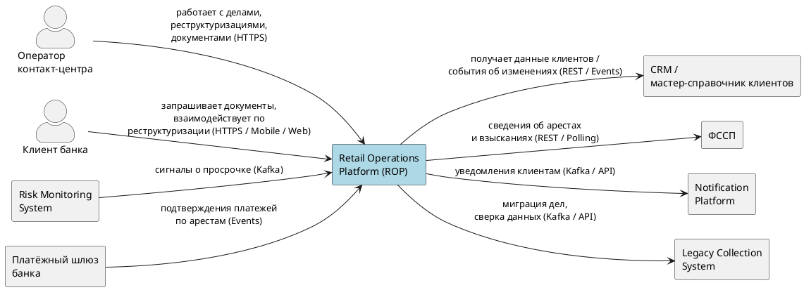
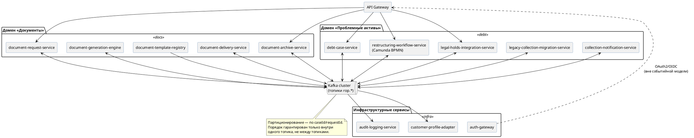

# 02. Архитектура

См. также [[01_overview]], [[03_services]], [[04_data_flows]].

## Архитектурный стиль

Event-driven, два доменных модуля («Документы», «Проблемные активы»), интеграция через Apache Kafka. Синхронные REST-вызовы между сервисами платформы допускаются только для:

- запросов текущего состояния (idempotent GET);
- атомарной проверки/установки распределённой блокировки, где по природе операции нужен синхронный ответ до старта длительного процесса (единственный документированный пример — захват `RestructuringWorkflowLock`, см. [[04_data_flows#Блокировка процесса реструктуризации]] и [[03_services#debt-case-service]]).

Всё остальное, что меняет состояние другого агрегата, передаётся Kafka-событием.

## C4: System Context

![[Pasted image 20260902161947.png]]

## Общая схема (event-driven core)

![[Pasted image 20260902161824.png]]

---
## Ключевые архитектурные решения

| Решение | Обоснование | Подробности |
|---|---|---|
| Command/event через Kafka вместо синхронных вызовов между сервисами | Процесс реструктуризации длится дни/недели — блокирующий синхронный вызов архитектурно неверен | [[04_data_flows#Saga command event pattern]] |
| Orchestration-based saga (Camunda) вместо хореографии | Единый source of truth по состоянию юридически чувствительного процесса, проще отладка и аудит | [[04_data_flows#Saga command event pattern]] |
| Inbox/outbox вместо распределённых транзакций | Kafka даёт at-least-once — exactly-once бизнес-эффект обеспечивается идемпотентностью на стороне потребителя/издателя | [[04_data_flows#Идемпотентность]] |
| Партиционирование Kafka-топиков по `caseId`/`requestId` + `aggregateVersion` в конверте события | Гарантия порядка есть только внутри одного топика; `aggregateVersion` даёт причинный порядок между топиками одного агрегата | [[04_data_flows#Порядок событий]] |
| HTML/CSS (Thymeleaf) → headless PDF вместо JasperReports | Рекурсивная вложенность документа нативно ложится на HTML/CSS, шаблон diff-able в PR | [[06_tech_stack]] |
| Schema Registry не разворачивается на текущем этапе | Дешёвая альтернатива (`schemaVersion` в конверте + контрактные тесты в CI) закрывает риск при текущем числе топиков; пересмотр — при росте числа consumer-групп | [[03_services#Формат сообщений и совместимость схем]] |
| Захват `RestructuringWorkflowLock` — единственный синхронный REST-вызов, меняющий состояние другого сервиса | Инвариант «не более одного активного процесса на caseId» физически не может проверяться асинхронно перед стартом длительного BPMN-процесса; лок физически хранится в `debt-case-service`, рядом с данными, которые защищает | [[04_data_flows#Блокировка процесса реструктуризации]] |

## Слои изоляции отказов

- `legal-holds-integration-service` изолирует нестабильный внешний источник (ФССП) через circuit breaker + bulkhead — см. [[06_tech_stack]].
- Компенсирующие обработчики саги — локальные идемпотентные операции без синхронных вызовов наружу — см. [[04_data_flows#Компенсации]].
- Структурно повреждённые Kafka-сообщения уходят в инфраструктурный DLQ-топик до попадания в бизнес-логику; бизнес-ошибки обрабатываются через inbox-статус `FAILED`, отдельного DLQ для них нет — см. [[03_services#Реестр топиков]].
