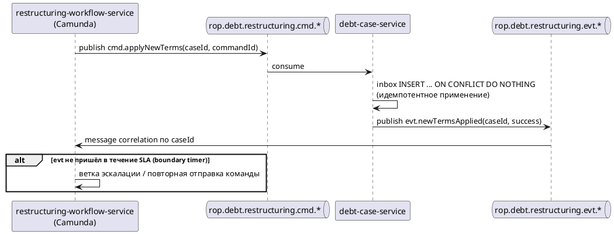
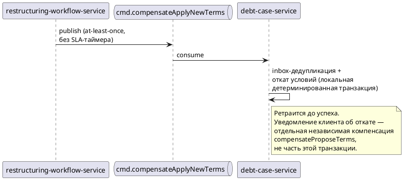
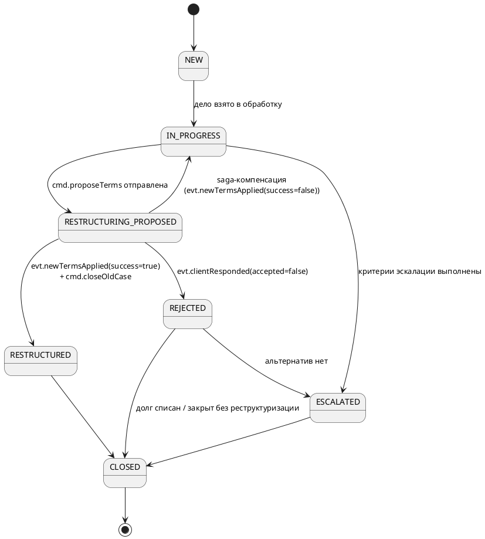
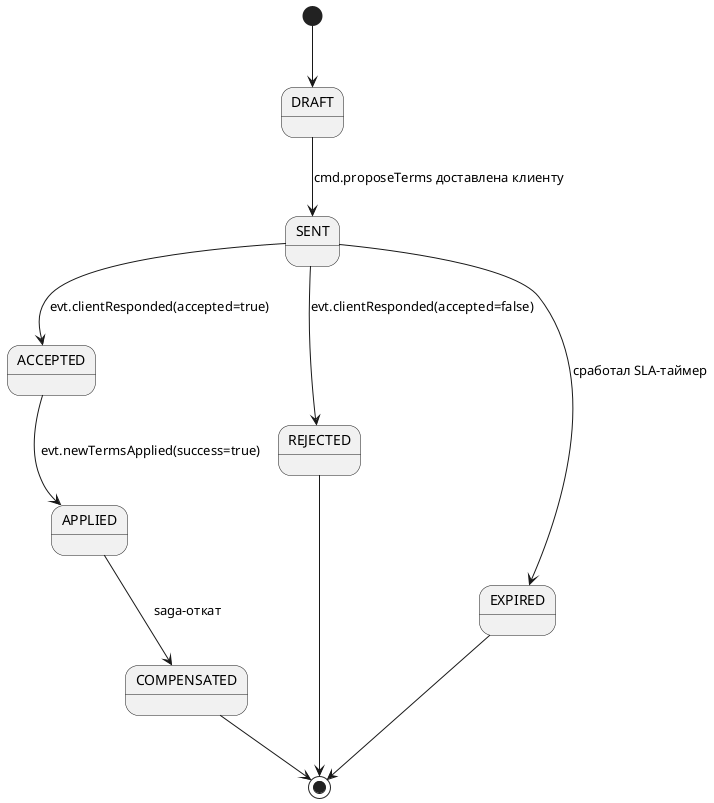
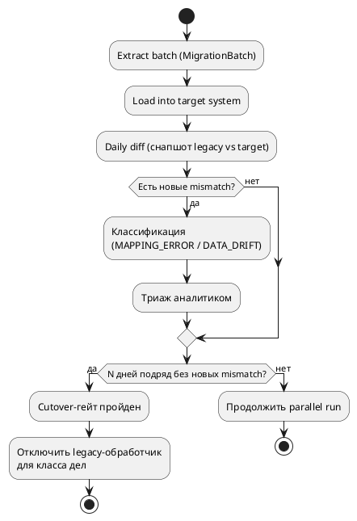

# 04. Доменная модель и событийные потоки

См. также [[02_architecture]], [[03_services]].

## Доменная модель

### Домен «Документы»

| Сущность | Ключевые поля | Комментарий |
|---|---|---|
| **DocumentRequest** | `id`, `idempotencyKey`, `subjectId`, `productId`, `documentType`, `period{from,to}`, `channel`, `status` (`CREATED→QUEUED→GENERATING→READY→DELIVERED→FAILED→CANCELLED`), `requestedAt` | Агрегат-корень домена |
| **DocumentTemplate** | `id`, `documentType`, `version`, `schemaDefinition`, `activeFrom`, `status` | Версионируется отдельно от запроса |
| **StatementNode** | `id`, `nodeType` (`PERIOD│SUB_PERIOD│TX_GROUP│TRANSACTION`), `parentId`, `children[]`, `amount`, `runningBalance` | Внутренняя модель `generation-engine`, персистируется опционально — [[#document-generation-engine]] |
| **GeneratedDocument** | `id`, `requestId`, `templateVersion`, `fileRef` (S3-ключ), `checksum`, `pageCount`, `signedAt`, `status` | Ссылается на конкретную версию шаблона (воспроизводимость) |
| **DeliveryRecord** | `id`, `documentId`, `channel`, `deliveredAt`, `status`, `attemptCount` | Один документ может пере-доставляться несколько раз |

### Домен «Проблемные активы»

| Сущность | Ключевые поля | Комментарий |
|---|---|---|
| **DebtCase** | `id`, `clientId`, `contractId`, `productId`, `aggregateVersion`, `status` (`NEW→IN_PROGRESS→RESTRUCTURING_PROPOSED→RESTRUCTURED│REJECTED→ESCALATED→CLOSED`), `overdueAmount`, `overdueDays`, `openedAt` | Агрегат-корень домена |
| **RestructuringProposal** | `id`, `caseId`, `proposedTerms{newRate,newTerm,newSchedule}`, `status` (`DRAFT→SENT→ACCEPTED│REJECTED│EXPIRED`; `ACCEPTED→APPLIED→COMPENSATED`), `sentAt`, `respondedAt` | Один `DebtCase` может иметь несколько предложений (история переговоров) |
| **LegalHold** | `id`, `caseId` (nullable), `clientId`, `sourceSystem`, `holdType`, `amount`, `basisDocument`, `status` (`ACTIVE→PARTIALLY_PAID→RELEASED`), `detectedAt` | Может существовать независимо от `DebtCase` |
| **CollectionEvent** | `id`, `caseId`, `eventType` (`NOTIFICATION_SENT│ESCALATED│PAYMENT_RECEIVED│CASE_CLOSED`), `occurredAt`, `payload` | Журнал по делу для UI оператора и аналитики |
| **MigrationBatch** | `id`, `batchNumber`, `sourceRange`, `status` (`EXTRACTED→VALIDATED→RECONCILING→RECONCILED→CUTOVER│FAILED`), `recordCount`, `mismatchCount` | Единица миграции |
| **ReconciliationRecord** | `id`, `batchId`, `legacyCaseId`, `targetCaseId`, `matchStatus` (`MATCH│MISMATCH`), `diff` | Построчный результат сверки |
| **RestructuringWorkflowLock** | `caseId` (PK), `activeProcessInstanceId`, `lockedAt` | Гарантирует не более одного активного процесса реструктуризации на `caseId`, хранится в `debt-case-service` — [[#Блокировка процесса реструктуризации]] |

### Связи

```
DocumentRequest ──1:1──> GeneratedDocument ──1:N──> DeliveryRecord
DocumentRequest ──N:1──> DocumentTemplate

DebtCase ──1:N──> RestructuringProposal
DebtCase ──1:N──> CollectionEvent
DebtCase ──0:N──> LegalHold          (через clientId, не обязательно через caseId)
DebtCase ──0:1──> RestructuringWorkflowLock
MigrationBatch ──1:N──> ReconciliationRecord ──N:1──> DebtCase (target)
```

## Идемпотентность

### Создание заявки на документ

`POST /api/v1/document-requests` принимает обязательный заголовок `Idempotency-Key`. Хэш файла как ключ не подходит — на момент запроса файла ещё не существует (запрос лишь триггерит асинхронную генерацию).

- Фронтенд генерирует UUID один раз на пользовательское действие и переиспользует его при retry на нестабильной сети до получения успешного ответа; после 2xx ключ инвалидируется.
- `document-request-service` хранит `idempotencyKey → requestId` с TTL 24–48ч. Повторный запрос с тем же ключом возвращает существующий `requestId` (`SELECT` по уникальному индексу перед `INSERT`).

### Inbox-паттерн для команд саги

Каждый исполнитель cmd-команд (в первую очередь `debt-case-service`) хранит inbox-таблицу:

| Поле | Назначение |
|---|---|
| `commandId` (PK) | Идентификатор команды из Kafka-сообщения |
| `caseId` | Для корреляции и дебага |
| `commandType` | `applyNewTerms` / `closeOldCase` / `compensateApplyNewTerms` и т.д. |
| `status` | `RECEIVED → PROCESSING → PROCESSED / FAILED` |
| `retryCount`, `lastError` | Диагностика |
| `processedAt` | — |

Обработка: `INSERT ... ON CONFLICT DO NOTHING` по `commandId` в той же транзакции, что и бизнес-эффект — exactly-once бизнес-эффект поверх at-least-once доставки. Сообщения читаются по одному, не батчами (при малом объёме — десятки сообщений в минуту — цена батчинга не окупает сложность частичного отката).

После исчерпания `retryCount` запись помечается `FAILED`, автоматические ретраи прекращаются, консьюмер не блокируется. Восстановление — явная admin-операция (`FAILED → RECEIVED`), не реконсьюм из Kafka: вся история попытки остаётся в одной записи (важно для аудита юридически чувствительного домена).

Отдельный инфраструктурный DLQ-топик существует только для структурно повреждённых сообщений (не проходят десериализацию/не соответствуют контракту) — то есть для сбоев до попадания в бизнес-логику.

### Outbox-паттерн для публикации доменных событий

`debt-case-service` пишет сериализованное событие в outbox-таблицу в той же транзакции, что и мутацию агрегата — атомарность на уровне одной БД. Отдельный relay-воркер вычитывает неотправленные записи через `SELECT ... FOR UPDATE SKIP LOCKED` и публикует в Kafka, помечая как отправленные после подтверждения брокера.

CDC (Debezium поверх WAL) рассмотрен и отклонён для текущего объёма (десятки событий в минуту): операционная сложность Kafka Connect не окупается — polling с `SKIP LOCKED` даёт задержку в секунды при заметно более простой эксплуатации.

## Saga: command/event pattern

BPMN-процесс не вызывает сервисы синхронно (процесс реструктуризации длится дни/недели — блокирующий вызов архитектурно неверен).

![[Pasted image 20260902165940.png]]



Оркестрация выбрана вместо хореографии: Camunda уже выступает центральным оркестратором долгоживущего процесса, дублировать роль распределённой хореографией избыточно и усложняет отладку юридически чувствительного процесса.

### Happy path / failure path

- **Happy path:** `ProposeTerms → (клиент принял) → ApplyNewTerms → CloseOldCase → End`
- **Failure path** (пример: `ApplyNewTerms` вернул `success=false` либо не пришёл в SLA):
  1. Error Boundary Event перехватывает ошибку на `ApplyNewTerms`.
  2. Compensation Event запускает компенсации уже выполненных шагов в обратном порядке: `CompensateApplyNewTerms` → `CompensateProposeTerms`.
  3. `DebtCase.status` возвращается в `IN_PROGRESS`, `RestructuringProposal.status = COMPENSATED`, `RestructuringWorkflowLock` снимается.
  4. Событие компенсации обязательно пишется в `rop.audit.event`.

## Компенсации

Оркестратор не может откатить состояние стороннего участника локально у себя — это верно для любой оркестрируемой саги. Гарантируется не «отсутствие внешних зависимостей», а **отсутствие тупиковых состояний при их отказе**:

![[Pasted image 20260902170133.png]]



- Компенсирующая команда доставляется брокером at-least-once.
- У компенсирующих cmd-топиков **нет** boundary timer / SLA-таймаута (в отличие от прямых шагов) — компенсация ретраится до успеха, а не переводит процесс в эскалацию по истечении времени.
- Обработчик компенсации — локальная детерминированная операция над собственной БД участника, без синхронных вызовов наружу внутри той же транзакции.
- Дедупликация — через тот же inbox, что и для основных команд.

## Блокировка процесса реструктуризации

Camunda коррелирует входящие `evt`-сообщения по `caseId`, что предполагает не более одного активного экземпляра процесса на `caseId`. Инвариант защищается сущностью `RestructuringWorkflowLock`, хранящейся в `debt-case-service` — рядом с данными, которые она защищает, а не в `restructuring-workflow-service`.

`restructuring-workflow-service` перед стартом процесса синхронно вызывает `POST /api/v1/debt-cases/{caseId}/restructuring-lock` (см. [[03_services#debt-case-service]]) — атомарный `INSERT ... ON CONFLICT (caseId) DO NOTHING`. При конфликте вызов отклоняется с бизнес-ошибкой «процесс уже запущен» вместо тихого создания второго экземпляра. Это единственный документированный синхронный вызов, меняющий состояние соседнего сервиса — исключение обосновано тем, что инвариант должен быть проверен атомарно **до** старта долгоживущего процесса, а не может быть выражен как ретроактивная асинхронная коррекция.

Лок снимается при переходе процесса в терминальное состояние (успех, компенсация, ручная эскалация). Фоновая проверка снимает orphaned-лок (устаревший `lockedAt` при отсутствии активного экземпляра в Camunda), с записью в `rop.audit.event`.

**Отклонённые альтернативы:**
- Блокировка повторного клика только на фронтенде — не решает проблему, race возможен и при легитимном сетевом ретрае.
- Оптимистичная блокировка `DebtCase` через `aggregateVersion` — защищает от одновременной записи в сущность, но не мешает запустить два процесса, которые ещё не дошли до записи.
- Распределённый лок через Redis/ZooKeeper — избыточная инфраструктурная зависимость ради инварианта, выражаемого обычным ограничением уникальности в реляционной модели.

## Порядок событий

Партиционирование по `caseId` гарантирует порядок **только внутри одного топика**. Три топика домена «Проблемные активы» (`case.opened`, `case.status-changed`, `case.payment-received`) относятся к одному агрегату `DebtCase`, но не имеют между собой гарантии межтопикового порядка, а подписчики на них не пересекаются полностью.

- Каждое событие `DebtCase` несёт поле **`aggregateVersion`** — монотонный счётчик, инкрементируемый в той же транзакции, что и мутация.
- Consumer'ы, которым нужен причинный порядок между топиками одного агрегата (в первую очередь `legacy-collection-migration-service`, слушающий и `case.opened`, и `case.status-changed`), буферизуют входящие события по `caseId` и применяют их в порядке `aggregateVersion`, не полагаясь на порядок доставки Kafka между топиками.
- Consumer'ы с подпиской на один тип события (`collection-notification-service`, `restructuring-workflow-service`) в буферизации не нуждаются.

## SLA-таймер эскалации

`RestructuringProposal.status = SENT → EXPIRED` — boundary timer event, триггер перехода `DebtCase → ESCALATED`.

Таймер стартует **не** от `evt.termsProposed` (которое фиксирует лишь постановку уведомления в очередь notification-платформы), а от `rop.notifications.sent` — с дополнительным запасом, рассчитанным по статистике фактической доставки push-уведомлений. Решение принято, чтобы избежать эскалации раньше, чем клиент физически мог узнать о предложении, без введения в контракт `collection-notification-service` отдельного статуса подтверждения доставки на уровне устройства (признано избыточным для этой задачи).

## Диаграммы состояний

### DebtCase.status



### RestructuringProposal.status



## document-generation-engine

Банковская выписка/справка — рекурсивное дерево, а не плоский набор полей для mail-merge:

```
Период выписки
 ├─ Под-период
 │   ├─ Группа транзакций
 │   │   ├─ Транзакция 1
 │   │   ├─ Транзакция 2
 │   │   └─ Промежуточный итог группы  ← вычисляется снизу вверх
 │   └─ Итог под-периода               ← агрегирует итоги всех групп
 └─ Итог периода + переходящий остаток ← агрегирует итоги под-периодов
```

**Two-phase pipeline:**
1. **Assembly** — сборка дерева `StatementNode`, рекурсивное вычисление агрегатов bottom-up. Результат не зависит от способа рендеринга.
2. **Render** — recursive-descent обход дерева, эмиссия PDF-блоков. Разбиение на страницы — на уровне узла, с использованием предрассчитанной высоты поддерева из фазы 1.

Разделение принципиально: assembly не знает про пагинацию, render не пересчитывает бизнес-агрегаты.

**Персистентность `StatementNode`** — только для деревьев выше порога (по числу узлов/ожидаемому page count):
- сериализуется одним объектом (Protobuf/MessagePack, не JSON — дешевле по объёму и разбору при большой глубине);
- хранится в объектном хранилище (S3, префикс `checkpoints/`), не в реляционной БД — чекпоинт технический, без потребности в реляционных запросах;
- удаляется явно после успешного Render, плюс S3 lifecycle TTL (24ч) как страховка на случай падения сервиса.

Для большинства запросов чекпоинтинг не нужен — полный пересчёт Assembly при сбое дешёвый.

## Reconciliation при миграции

Перенос выполняется поэтапным cutover по классам риска с параллельным прогоном (strangler fig) — старая и новая система одновременно обслуживают разные сегменты дел неделями/месяцами.



Известные источники расхождений: разная семантика `overdueDays` (legacy — ночной батч по рабочим дням, целевая — real-time по календарным дням); округление `Money` (`FLOAT` в legacy vs `BigDecimal HALF_UP` в целевой); race-окно в момент cutover; неоднозначный маппинг legacy числовых статус-кодов в `DelinquencyStatus`.

## Комплаенс и защита персональных данных

- **Классификация данных.** Явная разметка полей-ПДн на уровне модели (`clientId`-производные поля в `DebtCase`, `LegalHold`, `DocumentRequest`).
- **Право на удаление vs неизменяемый аудит-лог.** Решается псевдонимизацией/crypto-shredding: персональные атрибуты в `rop.audit.event` шифруются per-subject ключом, «удаление» = уничтожение ключа.
- **Доступ.** RBAC/ABAC «need to know»: row-level доступ к `DebtCase`/`LegalHold` только при открытом обращении по клиенту у конкретного оператора. Доступ к `audit-logging-service` логируется отдельно.
- **Шифрование.** Field-level encryption ПДн-полей в БД, mTLS между сервисами (включая внутренний Kafka-трафик), server-side encryption в S3 + проверка владения на `document-archive-service`'s `/download`.
- **Data residency.** Хранение и первичная обработка ПДн в РФ-юрисдикции (152-ФЗ) — ограничение на выбор инфраструктурного провайдера.
- **Retention.** Раздельные сроки: `GeneratedDocument` — по регуляторному сроку; `rop.audit.event` — 5–7+ лет; `LegalHold`/`DebtCase` — отдельный срок после закрытия дела. Автоматизированная архивация/истечение по категориям.
- **Непрод-окружения.** Маскирование/синтетические данные вместо реальных ПДн — [[08_developer_experience#Окружения]].
- **DPIA.** Формальная оценка воздействия перед релизом новых сценариев в домене «Проблемные активы» — отдельный процессный гейт, см. [[05_team_structure#Процессная модель]].
- **Договоры с третьими сторонами.** DPA-аналоги для внешних интеграций, через которые проходят ПДн (ФССП, платёжный шлюз, notification-платформа).
