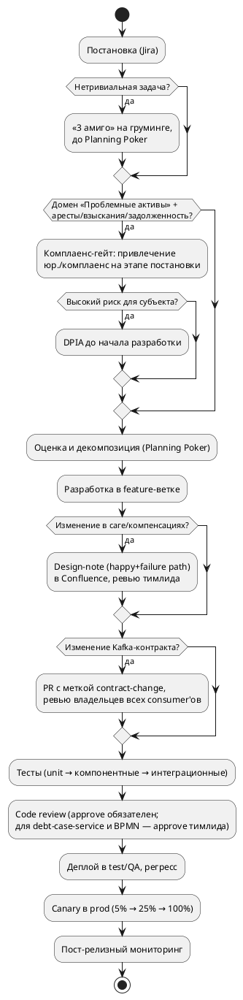

# 05. Команда и процессная модель

См. также [[01_overview]], [[08_developer_experience]].

## Состав команды

| Роль | Количество | Зона ответственности |
|---|---|---|
| Product Owner | 1 | Приоритизация бэклога, взаимодействие с бизнес-заказчиком (Retail Operations) |
| Tech Lead | 1 | Архитектурные решения, код-ревью критичных изменений (`debt-case-service`, BPMN-процессы), менторство |
| Backend-разработчики (Java/Kotlin) | 4–6 | Реализация сервисов, миграция legacy-функционала |
| Frontend-разработчик | 1 | Внутренние операционные UI (панели для сотрудников контакт-центра) |
| QA-инженеры | 2 | Автотесты, ручное тестирование сложных сценариев (юридические кейсы) |
| Системный аналитик | 1 | Постановки, взаимодействие с юридическим и комплаенс-департаментом |
| DevOps-инженер | 0.5 FTE | CI/CD, инфраструктура (частично шарится с соседними командами трайба) |
| Scrum Master / Agile-коуч | 1 (частично, shared) | Фасилитация процессов, метрики потока |

Итого: **~11–13 человек**, из них 5–7 в разработке.

## Два потока внутри одной команды

Команда организована как единая Scrum-команда с двумя условно независимыми под-потоками — свой пул задач в общем бэклоге у каждого, но общий стендап и общая ретроспектива раз в спринт:

| Поток | Домен | Типичный состав |
|---|---|---|
| **Документы** | [[01_overview#Два продуктовых домена|Документы]] | 1–2 backend-разработчика |
| **Проблемные активы** | [[01_overview#Два продуктовых домена|Проблемные активы]] | 3–4 backend-разработчика (наиболее нагруженный поток: saga, миграция, интеграции) |

> Задачи внутри потока «Проблемные активы» — inbox/outbox, миграция и сверка, resilience-паттерны для внешних интеграций, `RestructuringWorkflowLock`, контрактные тесты — типично распределены между 3–4 backend-инженерами, а не концентрируются на одном человеке: объём и юридическая чувствительность домена требуют параллельной работы нескольких разработчиков и обязательного код-ревью тимлида на каждое изменение в саге. См. [[08_developer_experience#Типовые зоны ответственности в потоке Проблемные активы]].

## Процессная модель

- Методология: **Scrum**, спринт — 2 недели.
- Уточнение требований — встречи «3 амиго» (аналитик + разработчик + QA) **на груминге/рефайнменте бэклога, до оценки в Planning Poker** — то есть до того, как задача считается готовой к взятию в спринт. Граничные случаи и объём тестового покрытия обсуждаются до оценки трудозатрат, иначе оценка систематически занижается.
- Allure TestOps — трекинг покрытия тестами.

### Комплаенс-гейт (домен «Проблемные активы»)

Отдельный процессный гейт вне обычного ритма спринта: если задача затрагивает работу с задолженностью, аресты, взыскания — аналитик обязан привлечь юридический/комплаенс-департамент уже на этапе написания требований и дизайна тест-кейсов (Privacy by Design), а не только перед финальным релизом. Для сценариев с высоким риском для субъекта (влияние на кредитную историю/исполнительное производство) — формальный DPIA до начала разработки.

На практике именно этот гейт, а не готовность кода, чаще всего определяет фактическую дату релиза для домена «Проблемные активы» — см. [[07_timeline]].

## Разработка → релиз (высокоуровнево)

Подробности окружений, git-workflow и тестирования — [[08_developer_experience]].

## Риски, связанные с командой

| Риск | Митигирующая мера |
|---|---|
| Нехватка QA-ресурсов при росте объёма фичей | Смещение части ответственности на DEV через компонентные тесты; для юридических сценариев — обязательное участие комплаенс в дизайне тест-кейсов |
| Юридическая чувствительность домена «Проблемные активы» | Обязательный review комплаенс-департамента на этапе постановки и перед релизом, полный аудит-лог, меры из [[04_data_flows#Комплаенс и защита персональных данных]] |
