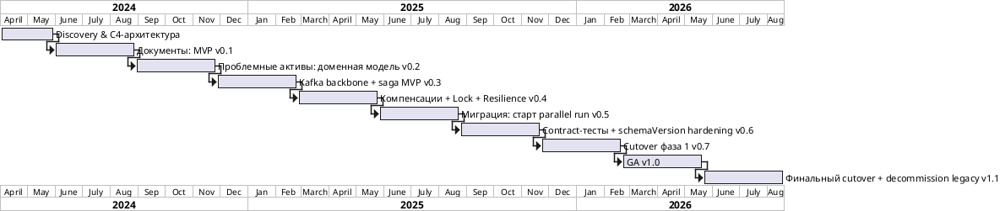

# 07. Таймлайн и milestones

См. также [[01_overview]], [[05_team_structure]].

> Исходный документ-первоисточник обрывает раздел с таймлайном без содержания. Ниже — реконструкция на основе заявленного горизонта (Q2 2024 — Q3 2026) и зафиксированных в архитектуре/процессах зависимостей между версиями (например, contract-тесты и `schemaVersion` формализованы **после** инцидента с несовместимой схемой события — см. [[08_developer_experience#Инцидент несовместимая схема события]]). Даты внутри квартала — ориентировочные.

## Общая длительность

**~2.5 года**, Q2 2024 — Q3/Q4 2026.

## Диаграмма

## Milestones

| Версия | Квартал | Содержание | Критерий выхода |
|---|---|---|---|
| — | Q2 2024 | Discovery, C4-модель, доменное моделирование обоих доменов | Архитектура согласована с Tech Lead и комплаенс-департаментом |
| v0.1 | Q3 2024 | Домен «Документы»: `document-request-service`, `document-template-registry`, PoC `document-generation-engine` (Assembly + Render на топ-5 частых типах справок) | Пилотная эксплуатация на ограниченном сегменте операторов |
| v0.2 | Q4 2024 | Домен «Проблемные активы»: доменная модель `DebtCase`, приём `rop.risk.overdue-signal.detected`, базовый CRUD, operator/client path (`PATCH /status`) | Дела открываются автоматически по риск-сигналу |
| v0.3 | Q1 2025 | Kafka event backbone, `restructuring-workflow-service` (Camunda) — happy path без компенсаций, inbox/outbox | Happy path реструктуризации проходит end-to-end на stage |
| v0.4 | Q2 2025 | Compensation boundary events, `RestructuringWorkflowLock`, `legal-holds-integration-service` с circuit breaker + bulkhead | Failure path саги не оставляет зависших дел |
| v0.5 | Q3 2025 | `legacy-collection-migration-service`, старт parallel run (strangler fig) по первому классу дел | Ежедневный reconciliation-отчёт, ручная проверка < 20 дел/неделю |
| v0.6 | Q4 2025 | Contract-тесты в CI, обязательный `schemaVersion` — по итогам инцидента с `overdueAmount` | Ни один PR с breaking change не проходит CI без ревью владельцев consumer'ов |
| v0.7 | Q1 2026 | Cutover фаза 1 — низкорисковые классы дел переключены на целевую систему | N дней подряд без новых mismatch по переключённым классам |
| v1.0 (GA) | Q2 2026 | Полный домен «Проблемные активы» в проде, canary-релиз (5%→25%→100%) как стандарт, комплаенс-гейт формализован | SLA по эскалации, инбоксу и compensation соблюдаются в проде |
| v1.1 | Q3 2026 (текущий) | Финальный cutover оставшихся классов дел, план вывода legacy-системы из эксплуатации, PoC headless-рендерера для document-generation-engine (большие деревья) | Legacy-обработчик отключён для всех классов дел |

## Зависимости между milestones

- v0.3 (Kafka backbone) — обязательное условие для v0.4 (компенсации не могут быть реализованы без command/event-инфраструктуры).
- v0.5 (миграция) технически не зависит от v0.4, но по процессу не стартует без пройденного комплаенс-гейта — см. [[05_team_structure#Комплаенс-гейт домен Проблемные активы]].
- v0.6 (contract-тесты) — реактивный milestone, введён по итогам инцидента, а не запланирован заранее; фактическая дата определялась постмортемом, а не изначальным планом.
- v1.1 (decommission legacy) не может начаться, пока `legacy-collection-migration-service` не подтвердит нулевой mismatch по всем оставшимся классам дел на протяжении согласованного периода — см. [[04_data_flows#Reconciliation при миграции]].
