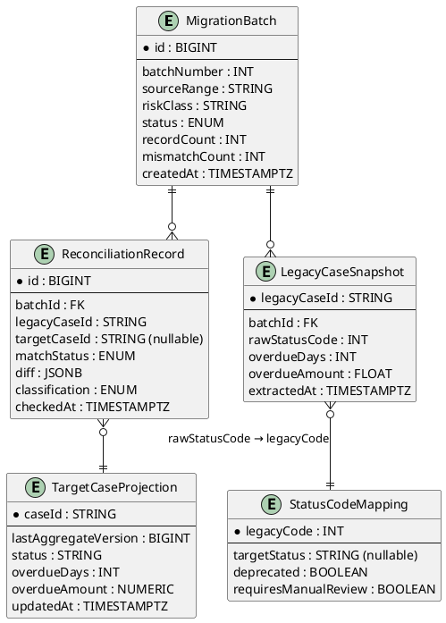
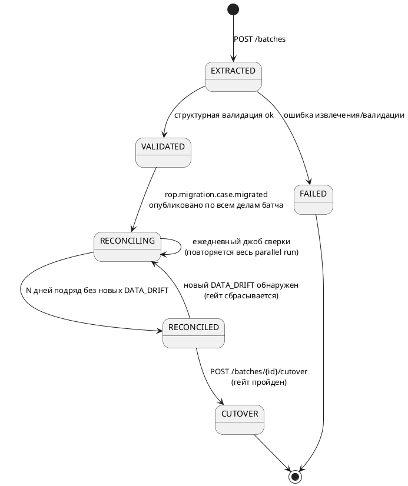
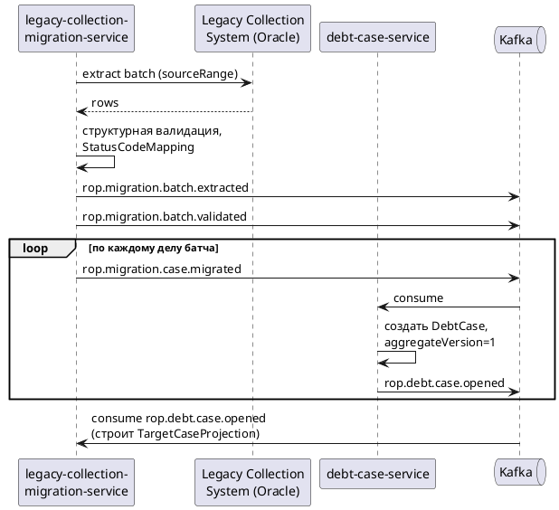
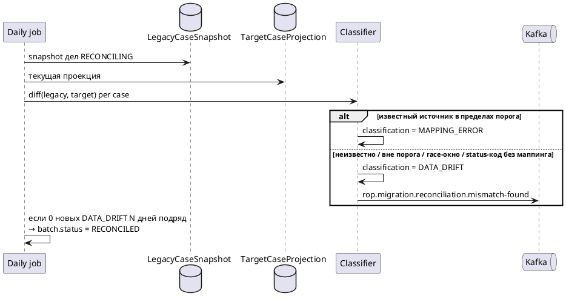
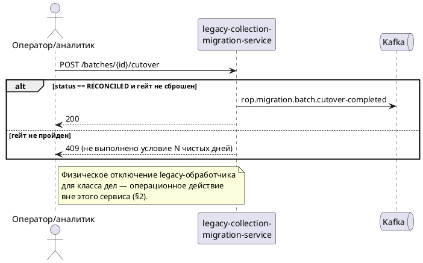

# SDD — legacy-collection-migration-service


## 1. Назначение и жизненный цикл

Сервис переносит `DebtCase` из Legacy Collection System (Oracle) в `debt-case-service` поэтапно, по классам риска, методом **strangler fig**: legacy и целевая система параллельно обслуживают разные сегменты дел неделями/месяцами, часть уже перенесённых дел продолжает получать мутации в legacy (ручная работа оператора в старом интерфейсе) — отсюда постоянная, а не разовая потребность в сверке на весь период parallel run.

**Это не постоянный домен.** Жизненный цикл сервиса привязан к проекту миграции, а не к бизнес-домену:

```
создание → активная эксплуатация (батчи + ежедневная сверка) → cutover всех классов риска → decommission
```

Критерии и процедура вывода из эксплуатации — §10.

## 2. Границы

**В скоупе:**

- Извлечение батча дел из legacy, структурная валидация, трансформация в целевую схему.
- Публикация факта миграции дела как событие (создание самого агрегата `DebtCase` — ответственность `debt-case-service`, не этого сервиса; см. принцип «нет прямых записей в чужую БД», [[02_architecture#Принципы]]).
- Поддержание локальной read-проекции состояния целевой системы (по `rop.debt.case.opened`/`.status-changed`), а не прямые запросы к `debt-case-service`.
- Ежедневная сверка legacy-снапшота против локальной проекции, авто-классификация расхождений.
- Cutover-гейт: разрешение перехода класса дел на целевую систему только после N дней подряд без новых необъяснённых расхождений.

**Вне скоупа:**

- Запись обратно в legacy — только чтение.
- Ручное исправление данных — сервис публикует необъяснённый остаток расхождений, разбор — задача аналитика/оператора вне этого сервиса (см. риски, §13).
- Физическое отключение legacy-обработчика для класса дел после cutover — операционное действие вне кода сервиса; сервис только формирует событие-разрешение (`rop.migration.batch.cutover-completed`).
- Бизнес-логика мутации `DebtCase` — не дублируется, полностью в `debt-case-service`.

## 3. Функциональные требования

|ID|Требование|
|---|---|
|FR1|Извлечь батч дел из legacy по заданному диапазону, провалидировать структурно, перевести в `VALIDATED`|
|FR2|Трансформировать каждое дело в целевую схему (маппинг статус-кодов, см. §7) и опубликовать `rop.migration.case.migrated`; создание агрегата — на стороне `debt-case-service`|
|FR3|Поддерживать локальную read-проекцию `DebtCase` по `caseId`, построенную из `rop.debt.case.opened`/`.status-changed`, применяя события в порядке `aggregateVersion` (буферизация — см. [[02_architecture#Межтопиковый порядок и aggregateVersion]])|
|FR4|Ежедневный batch-джоб: сравнить legacy-снапшот с локальной проекцией по ключевым полям на весь период parallel run для дел в статусе `RECONCILING`|
|FR5|Авто-классифицировать каждое расхождение как `MAPPING_ERROR` (детерминированная известная причина) либо `DATA_DRIFT` (неизвестная/непредсказанная); опубликовать в `rop.migration.reconciliation.mismatch-found` только необъяснённый остаток (`DATA_DRIFT`)|
|FR6|Разрешить `cutover` для класса дел только если N дней подряд — 0 новых `DATA_DRIFT` по всем делам класса; ручной cutover без выполнения условия — отклонить (409)|
|FR7|Отдать отчёт по расхождениям батча (`GET .../reconciliation-report`) с фильтрацией по дате и `matchStatus`|

## 4. Доменная модель

![[Pasted image 20260903162407.png]]

(расшифровка картинки:)


`LegacyCaseSnapshot`, `TargetCaseProjection`, `StatusCodeMapping` — внутренние таблицы реализации, не выносятся как доменные агрегаты в C4-модель [[03_services]] (они не публикуются как контракт наружу).

## 5. Состояния `MigrationBatch`

![[Pasted image 20260903162527.png]]

(расшифровка картинки:)


## 6. API

|Метод|Путь|Назначение|
|---|---|---|
|`POST`|`/api/v1/migration/batches`|Создать батч (`sourceRange`, `riskClass`), запускает FR1 асинхронно|
|`GET`|`/api/v1/migration/batches/{id}`|Статус батча|
|`GET`|`/api/v1/migration/batches/{id}/reconciliation-report?date=&matchStatus=`|Отчёт по расхождениям|
|`POST`|`/api/v1/migration/batches/{id}/cutover`|Инициировать cutover; `409`, если гейт (FR6) не пройден|

## 7. Контракты событий

**Consumes** (буферизация по `caseId`, применение в порядке `aggregateVersion`, идемпотентно — старая/дублирующая версия отбрасывается сравнением `incoming.aggregateVersion > stored.lastAggregateVersion`, отдельный inbox не нужен):

- `rop.debt.case.opened`
- `rop.debt.case.status-changed`

**Produces** (конверт со `schemaVersion`, `eventType`, `occurredAt` — конвенция [[02_architecture#Совместимость схем]]):

|Топик|Ключевые поля payload|
|---|---|
|`rop.migration.batch.extracted`|`batchId`, `recordCount`, `sourceRange`|
|`rop.migration.batch.validated`|`batchId`, `validRecordCount`, `rejectedRecordCount`|
|`rop.migration.case.migrated`|`legacyCaseId`, `targetCasePayload{clientId,contractId,productId,status,overdueAmount,overdueDays}`, `batchId`|
|`rop.migration.reconciliation.mismatch-found`|`batchId`, `legacyCaseId`, `targetCaseId`, `diff`, `classification=DATA_DRIFT`|
|`rop.migration.batch.cutover-completed`|`batchId`, `riskClass`, `consecutiveCleanDays`|

## 8. Алгоритм классификации расхождений

Правило по умолчанию — `DATA_DRIFT` (fail-safe: неизвестное расхождение никогда не проглатывается молча). В `MAPPING_ERROR` переводятся только 4 задокументированных источника, с конфигурируемыми (не захардкоженными) порогами:

|Источник|Условие авто-классификации `MAPPING_ERROR`|Иначе|
|---|---|---|
|`overdueDays`: legacy считает по рабочим дням ночным батчем, target — real-time по календарным|`|diff|
|`overdueAmount` округление: legacy `FLOAT` с усечением, target `BigDecimal HALF_UP`|`|diff|
|Race-окно в момент cutover: платёж на границе переключения|**Никогда не авто-классифицируется** — только флаг `requires_manual_review`, т.к. риск замаскировать реальную потерю платежа|—|
|Статус-код legacy `1..7`, включая deprecated без документации|**Никогда не авто-классифицируется** — `StatusCodeMapping.requiresManualReview=true` для любого не подтверждённого маппинга|всегда ручной разбор|

Пороги для первых двух источников утверждаются комплаенс/аналитиком при постановке (см. [[05_team_structure]] — комплаенс-гейт на этапе постановки), не решением разработчика в одиночку.

## 9. Нефункциональные требования

- **Объём.** Базовая нагрузка ручной сверки до автоматизации — ~400 дел/неделю; за весь проект миграции — ориентир 40 000+ дел. Ежедневный джоб сверки должен укладываться в ночное окно (часы, не десятки минут на весь объём активных `RECONCILING`-дел).
- **Отсутствие SLA на латентность** — фоновый/batch-сервис, не пользовательский путь.
- **Наблюдаемость.** Алертинг по: батчам, зависшим в `RECONCILING` дольше ожидаемого; росту `mismatchCount`; возрасту необработанных `DATA_DRIFT`-записей.
- **Аудируемость.** Каждое решение классификатора и каждый cutover — событие в `rop.audit.event` (юридически значимый домен, §11 исходного архитектурного документа).
- **ПДн.** `LegacyCaseSnapshot` содержит те же категории ПДн, что и `DebtCase` — те же меры: field-level encryption, маскирование в непрод (§11.7 исходного архитектурного документа).

## 10. Сценарии (sequence diagrams)

![[Pasted image 20260903165001.png]]



![[Pasted image 20260903165005.png]]



![[Pasted image 20260903165101.png]]



## 11. Обработка отказов

- Ошибка извлечения/валидации батча целиком → `FAILED`, admin-retry (создание нового батча с тем же `sourceRange` после устранения причины).
- Частичный сбой трансформации отдельных дел внутри батча → не роняет батч; такие дела не публикуются в `rop.migration.case.migrated`, остаются вне `recordCount` успешных, попадают в отдельный список для ручного разбора (расширение отчёта FR7).
- Out-of-order / дублирующая доставка `rop.debt.case.*` → естественная идемпотентность через сравнение `aggregateVersion`, без отдельного inbox.
- Гейт cutover сбрасывается (`RECONCILED → RECONCILING`) при любом новом `DATA_DRIFT`, даже если батч уже был близок к cutover — не допускается «зачёт» старых чистых дней при новом расхождении.

## 12. Вывод из эксплуатации

Критерий: все классы риска прошли `CUTOVER`, legacy-обработчик отключён операционно для всех классов.

Порядок:

1. Финальный экспорт `ReconciliationRecord`/`MigrationBatch` истории в холодное хранилище (объектное хранилище, тот же принцип retention, что и для `rop.audit.event`, §11.6 исходного архитектурного документа) — обязателен до decommission, т.к. срок хранения юридически значимых данных не совпадает со сроком жизни сервиса.
2. Отключение consumer-групп на `rop.debt.case.*`.
3. Вывод сервиса и его БД из эксплуатации; топики `rop.migration.*` не удаляются немедленно — сохраняются retention-политикой брокера на случай постфактум-аудита.

## 13. Риски и открытые вопросы

|Риск/вопрос|Комментарий|
|---|---|
|Точный формат `sourceRange` не определён в исходной документации|Диапазон ID дел? Диапазон дат открытия? Требует уточнения на этапе постановки конкретного батча — не решается на уровне SDD|
|Механизм доступа к legacy не специфицирован|Предположение: read-only реплика Oracle, JDBC pull. Требует подтверждения с владельцами Legacy Collection System|
|Пороги `MAPPING_ERROR` — плейсхолдеры|Нужно утверждение комплаенс/аналитика перед первым боевым батчом, не хардкодить в коде — хранить как конфигурацию с историей изменений (аудит порогов)|
|Риск маскировки реальных дефектов автоклассификацией|Даже корректно настроенный классификатор может со временем скрывать новый вид расхождения под старую причину. Рекомендация: периодическая выборочная ручная проверка случайной подвыборки записей, классифицированных как `MAPPING_ERROR`, — не полагаться на автоматизацию как на источник истины без проверки|