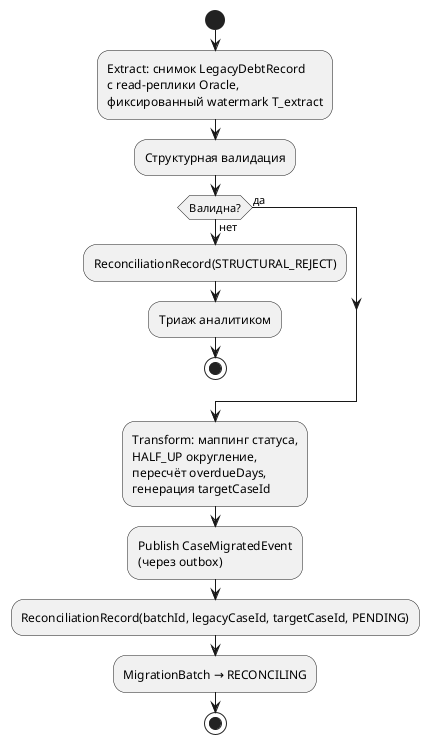

# 10. SDD: legacy-collection-migration-service

Design-документ на реализацию сервиса миграции. Дополняет [[03_services]], [[04_data_flows]], [[06_tech_stack]]. Расширяет модель `MigrationBatch`/`ReconciliationRecord` из [[04_data_flows#Доменная модель]] — расширения помечены явно.

---

## 1. Зачем отдельный сервис, а не переключение фронтенда

Наивная альтернатива — отключить legacy-фронтенд и переключить операторов на целевую систему разом. Не работает по трём причинам:

1. **Данные должны существовать в целевой системе до переключения.** Простого redirect недостаточно — `debt-case-service` ничего не знает о деле, пока оно не перенесено.
2. **Перенос не мгновенный и не атомарный по всей базе** — юридически чувствительный домен требует поэтапного переноса по классам риска с проверкой корректности каждого класса, а не одномоментного bulk-load всей базы.
3. **Legacy не отключается сразу после переноса конкретного класса дел.** Сервис переносит `DebtCase` из Legacy Collection System (Oracle) в `debt-case-service` поэтапно, методом strangler fig: legacy и целевая система параллельно обслуживают разные сегменты дел неделями/месяцами. Часть уже перенесённых дел продолжает получать мутации в legacy — операторы по привычке или из-за неполного доступа продолжают работать в старом интерфейсе, пока доступ к legacy для мигрированных классов не отключён административно. Отсюда постоянная, а не разовая потребность в сверке на весь период parallel run — и отдельный сервис, который эту сверку выполняет и накапливает историю для комплаенс.

Сервис — временный, привязанный к проекту миграции компонент (в отличие от `debt-case-service`, который живёт бессрочно) — см. [[07_timeline]].

## 2. Контракты данных

### 2.1 Источник: Legacy Collection System (Oracle)

```java
// Снимок строки из legacy-таблицы COLLECTION_CASE, читается с read-реплики
public class LegacyDebtRecord {
    String legacyCaseId;        // legacy PK, напр. "COL-000123456"
    String clientId;
    String contractId;
    BigDecimal overdueAmount;   // хранится как NUMBER, но исторически писался как FLOAT-усечение без rounding mode
    String currencyCode;        // ISO 4217; NULL в старых строках — подразумевается RUB
    Integer statusCode;         // 1..7, часть — deprecated без актуальной документации
    LocalDate overdueSinceDate; // дата начала просрочки
    Integer overdueDaysNightly; // подсчитан ночной batch-джобой legacy, только рабочие дни
}
```

### 2.2 Отличия legacy vs целевая модель

|Поле|Legacy|Целевая система (`DebtCase`)|
|---|---|---|
|Сумма долга|`NUMBER`, исторически без rounding mode|`Money{amount: BigDecimal, currency}`, `HALF_UP`|
|Статус|`Integer` код 1..7, часть deprecated|`DelinquencyStatus` enum|
|Просрочка|Целое число, ночной батч, только рабочие дни|Real-time, календарные дни от `overdueSinceDate`|
|Идентификатор|`legacyCaseId` (строка)|`caseId` (UUID), `legacyCaseId` хранится как внешняя ссылка|
|Валюта|Nullable, подразумевается RUB|Обязательное поле|

Различия — источник расхождений при сверке, см. [[04_data_flows#Reconciliation при миграции]]; часть из них (округление, семантика `overdueDays`) снимается на этапе трансформации (см. 2.4), часть (маппинг deprecated-кодов) требует ручного согласования с аналитиком на этапе структурной валидации.

### 2.3 Контракт события `rop.migration.case.migrated`

```java
public class CaseMigratedEvent {
    String eventType = "CaseMigrated";
    int schemaVersion = 1;
    String targetCaseId;        // UUID, сгенерирован migration-сервисом на этапе Transform — становится DebtCase.id
    String legacyCaseId;        // для аудита и корреляции с ReconciliationRecord
    String clientId;
    String contractId;
    Money overdueAmount;
    DelinquencyStatus status;
    int overdueDays;
    LocalDate overdueSinceDate;
    String batchId;
    Instant occurredAt;
}
```

`targetCaseId` генерируется на стороне migration-сервиса (не `debt-case-service`) — это даёт `ReconciliationRecord` известную пару `legacyCaseId → targetCaseId` сразу при трансформации, до того как `debt-case-service` вообще обработает событие. `debt-case-service` консьюмит событие, идемпотентно (по `targetCaseId`) создаёт `DebtCase` с `aggregateVersion = 1` и далее публикует `case.opened` по обычной логике — миграция не создаёт отдельный тип бутстрапа, использует существующий путь создания дела.

### 2.4 Структурная валидация

Отдельный шаг **до** трансформации — не то же самое, что сверка после загрузки. Задача — не пропустить в целевую систему запись, которую нельзя корректно трансформировать, и явно отделить такие записи от «расхождений» (`MISMATCH`), которые обнаруживаются позже при живой сверке.

```java
public class LegacyRecordValidator {
    private final Map<Integer, DelinquencyStatus> statusMapping; // согласуется с аналитиком, deprecated-коды — явно НЕ включены

    public ValidationResult validate(LegacyDebtRecord r) {
        List<String> errors = new ArrayList<>();
        if (r.legacyCaseId == null) errors.add("legacyCaseId: required");
        if (r.overdueAmount == null || r.overdueAmount.signum() < 0)
            errors.add("overdueAmount: missing or negative");
        if (!statusMapping.containsKey(r.statusCode))
            errors.add("statusCode: unmapped legacy code " + r.statusCode);
        if (r.overdueSinceDate == null) errors.add("overdueSinceDate: required");
        return new ValidationResult(errors.isEmpty(), errors);
    }
}
```

Запись, не прошедшая валидацию, **не трансформируется и не загружается** — уходит в `ReconciliationRecord` со статусом `STRUCTURAL_REJECT` (расширение enum `matchStatus` из [[04_data_flows#Доменная модель]], добавлено к исходным `MATCH`/`MISMATCH`) в очередь ручного триажа аналитику. Типичная причина — deprecated `statusCode`, для которого ещё не согласован маппинг.

## 3. Pipeline

![[Pasted image 20260903180436.png]]



Reuse: Publish через outbox — тот же паттерн (`SELECT ... FOR UPDATE SKIP LOCKED` + relay-воркер), что уже принят для `debt-case-service`, см. [[04_data_flows#Outbox паттерн для публикации доменных событий]].

## 4. Полный путь одного дела

1. Аналитик инициирует `POST /migration/batches` с критерием отбора (класс риска) → `MigrationBatch(status=EXTRACTED)` после завершения Extract.
2. Каждая запись проходит структурную валидацию (§2.4). Невалидные — в триаж, не идут дальше.
3. Валидные — трансформируются, публикуются как `CaseMigratedEvent`; `MigrationBatch → VALIDATED` после публикации всех событий батча.
4. `debt-case-service` создаёт `DebtCase`, эмитит `case.opened`. С этого момента целевая система — источник истины для дела; любые последующие штатные операции (реструктуризация, платежи) идут через целевые API/сагу.
5. `MigrationBatch → RECONCILING`. Начинается период parallel run: legacy формально продолжает существовать, доступ к нему для мигрированных дел не заблокирован технически (только организационно), поэтому возможны stray-правки в legacy оператором по привычке.
6. Ежедневная сверка (§5) сравнивает legacy-снимок с проекцией целевой системы. `MATCH` — тихо; `MISMATCH` — в триаж аналитику.
7. После N дней подряд без новых `MISMATCH` для батча → `MigrationBatch → RECONCILED`, дальше — `CUTOVER` (§6).

## 5. Reconciliation при Eventual Consistency

### 5.1 Почему наивное сравнение ломается

Наивный вариант: прочитать legacy-снимок и сразу же синхронно запросить текущее состояние дела через `GET /debt-cases/{id}` у `debt-case-service`, сравнить. Проблема — обе стороны читаются в разные, не согласованные между собой моменты относительно потока Kafka-событий:

- Между извлечением legacy-снимка и запросом к целевой системе могло пройти событие, которое сервис ещё не успел применить (задержка outbox-relay/consumer lag) — ложный `MISMATCH`.
- При немонотонной последовательности статусов (пример: `NOT_BANNED → BANNED → NOT_BANNED`) live-запрос в произвольный момент может попасть на промежуточное состояние, не совпадающее ни с тем, что было в legacy на момент снимка, ни с финальным состоянием — результат сравнения зависит от точного момента запроса, что делает его недетерминированным и невоспроизводимым.
- Простое «окно ожидания» перед запросом снижает вероятность, но не даёт гарантии: окно фиксированной длины не привязано к тому, что реально применилось, а просто гадает по времени.

Корень проблемы: `GET`-запрос к `debt-case-service` не даёт ответа на вопрос «состояние **по состоянию на** какой момент/версию агрегата это значение» — только «что там сейчас, в момент ответа».

### 5.2 Решение: `TargetCaseProjection` как read-model поверх тех же Kafka-событий

Вместо синхронных запросов к `debt-case-service`, `legacy-collection-migration-service` строит собственную материализованную проекцию, консьюмируя те же доменные события, которые уже обязан упорядочивать по `aggregateVersion` — см. [[04_data_flows#Порядок событий]]. Это не новая работа, а расширение существующей ответственности: сервис и так буферизует и применяет `case.opened`/`case.status-changed` в правильном порядке для собственных нужд (привязка мигрированных дел); материализация — просто сохранение результата вместо использования его «на лету».

```java
public class TargetCaseProjection {
    String caseId;
    String legacyCaseId;
    Money overdueAmount;
    DelinquencyStatus status;
    int overdueDays;
    long lastAppliedAggregateVersion;
    Instant lastAppliedOccurredAt;
}

public class ProjectionUpdater {
    // consumer rop.debt.case.opened / .status-changed / .payment-received
    // буферизация и порядок — как в существующем consumer'е миграционного сервиса
    void apply(DebtCaseDomainEvent event) {
        TargetCaseProjection p = repository.getOrCreate(event.caseId());
        if (event.aggregateVersion() <= p.lastAppliedAggregateVersion) return; // уже применено, идемпотентно
        p.applyMutation(event);
        p.lastAppliedAggregateVersion = event.aggregateVersion();
        p.lastAppliedOccurredAt = event.occurredAt();
        repository.save(p);
    }
}
```

Сравнение при сверке идёт **не** с live-состоянием `debt-case-service`, а с этой проекцией — источник которой сам сервис миграции полностью контролирует и версионирует.

### 5.3 Почему «сравнение + окно ожидания» не выбрано как основной механизм

Подход из вопроса (сравнивать legacy и target напрямую, подождав окно на consistency) технически проще, но требует от `debt-case-service` уметь отвечать на вопрос «каким было состояние дела на момент T» — то есть по сути ту же темпоральность, которую даёт проекция, только реализованную как API поверх основного, «горячего» сервиса вместо временного read-model в disposable-сервисе миграции. Дополнительно:

- Live-запросы десятков тысяч дел на каждую ночную сверку — дополнительная read-нагрузка на `debt-case-service`, которой можно избежать.
- Точное окно ожидания без привязки к реальному consumer lag — эвристика, которая либо избыточно консервативна, либо иногда всё равно ловит гонку.

Проекция полностью снимает эту проблему: сравнение всегда идёт с состоянием, которое **действительно было** валидным результатом применения событий в правильном порядке — а не с произвольным срезом, пойманным live-запросом.

### 5.4 Почему это не гонка `BAN → UNBAN → BAN`

Проекция обновляется строго в порядке `aggregateVersion`, поэтому в любой момент времени содержит состояние, которое **реально существовало** в истории агрегата — не может отразить невозможную промежуточную комбинацию. Сверка не пытается поймать конкретный промежуточный статус — она сравнивает **последнее применённое** состояние проекции с legacy-снимком. Если после `T_extract` в целевой системе произошли легитимные бизнес-изменения (реструктуризация, платёж) — это не гонка, а реальное расхождение с legacy-снимком, и оно **должно** попасть в `MISMATCH`: именно так обнаруживаются случаи, когда legacy получила stray-правку после миграции дела (см. §1, п.3) — это и есть содержательная цель сверки, а не шум, который нужно подавлять.

### 5.5 Защита от staleness проекции

Единственный оставшийся риск — не гонка, а **отставание консьюмера проекции**. Правило: сверка не сравнивает дело, если `lastAppliedOccurredAt` проекции отстаёт от текущего момента больше, чем на пороговое значение (напр. 30 минут, с запасом на relay-задержку outbox) — такое дело откладывается на следующий ночной прогон (`matchStatus = DEFERRED`, ещё одно расширение enum), а не сравнивается как есть. Отдельный алерт на затянувшийся consumer lag проекции — по той же схеме мониторинга, что уже используется для `collection-notification-service` (см. [[08_developer_experience#Наблюдаемость на дежурстве]]).

## 6. Холодное хранилище после CUTOVER

По переходу `MigrationBatch.status → CUTOVER` сервис автоматически архивирует:

|Артефакт|Содержимое|Зачем|
|---|---|---|
|Финальные `ReconciliationRecord` батча|legacy-значения, target-значения, `matchStatus`, `diff`, кто и когда разрешил расхождение|Доказательство корректности переноса для комплаенс-разбора/спора клиента|
|Финальный legacy-снимок (`LegacyDebtRecord[]`)|Состояние записей legacy на момент cutover|Юридическая точка отсчёта — «как выглядели данные до отключения legacy для этого класса»|
|Метаданные `MigrationBatch`|Критерий отбора, счётчики, ссылка на тикет/согласование комплаенс о cutover|Аудируемая причинно-следственная цепочка решения о переключении|

**Где:** объектное хранилище (S3), отдельный префикс `migration-archive/{batchId}/` — не тот же префикс, что «горячие» технические чекпоинты `document-generation-engine` (`checkpoints/`, короткий TTL, см. [[04_data_flows#document-generation-engine]]): здесь retention долгий (5–7+ лет, вровень с `rop.audit.event`, см. [[04_data_flows#Комплаенс и защита персональных данных]]), а не «до конца рендера».

**Кто участвует:**

- `legacy-collection-migration-service` — сам архивирует данные при переходе в `CUTOVER`, считает и пишет checksum, публикует в `rop.audit.event` только ссылку на расположение архива и checksum (не сами ПДн — они остаются в S3 под отдельным access-контролем, по аналогии с [[04_data_flows#Комплаенс и защита персональных данных|field-level encryption]]).
- Комплаенс/DPO-команда — уведомляется о создании архива (тот же ops/комплаенс-канал, что и по остальным алертам домена); архив — то, к чему обращаются при разборе споров по историческим данным.
- После подтверждённого архивирования (сверка checksum) — «горячие» рабочие таблицы этого батча в операционной БД сервиса миграции (сырые staging-строки extract, уже разрешённые `STRUCTURAL_REJECT`-записи) вычищаются: сам `legacy-collection-migration-service` — временный компонент, подлежащий decommission вместе с legacy-системой (см. [[07_timeline]]), и не должен накапливать бессрочно растущую операционную БД — при этом архивная копия в S3 переживает выключение самого сервиса.

## 7. Открытые риски

|Риск|Мера|
|---|---|
|Операторы продолжают писать в legacy для уже мигрированных дел дольше ожидаемого|Reconciliation ловит это как `MISMATCH`; административное отключение доступа к legacy по классу — отдельная организационная задача, не техническая|
|Deprecated legacy-коды статуса без задокументированной семантики|`STRUCTURAL_REJECT` не даёт им попасть в целевую систему молча; список требует периодического согласования с аналитиком, не закрывается одним разом|
|Consumer lag проекции маскирует реальные расхождения|`DEFERRED`-статус + алертинг на lag, не сравнивать «на глаз»|
|Рост объёма архивов в S3|Отдельный долгий retention-класс (`migration-archive/`), не совпадает с ротацией «горячих» чекпоинтов|