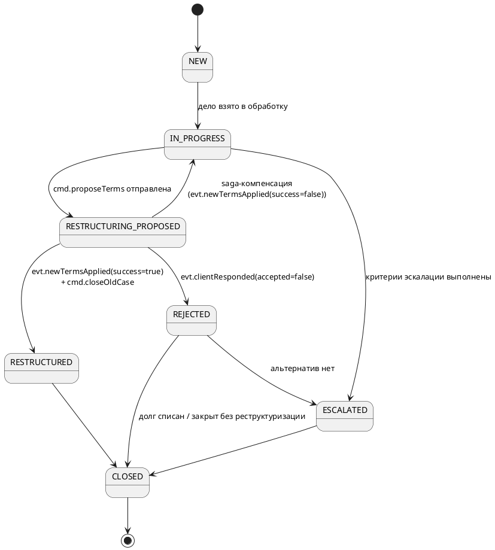
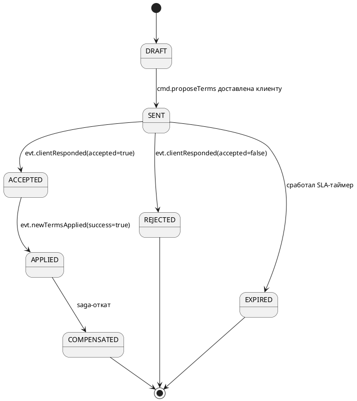

Tags: [[HR параша]]


### [[4 years - Raiffeisen + RSHB - Resume]]

[[4 years - Raiffeisen + RSHB - Resume Draft (Most recent)]]

# Диаграмы проекта

![[C4_layer_1SystemContext-001-dark.png|700]]

```Structurizr DSL
workspace "Retail Operations Platform" "C4 System Context Diagram" {

    model {
        operator = person "Оператор контакт-центра" "Работает с проблемными активами, заявками и документами."
        customer = person "Клиент банка" "Получает документы и взаимодействует по вопросам задолженности."

        rop = softwareSystem "Retail Operations Platform" "Платформа для управления документами и проблемными активами."

        crm = softwareSystem "CRM / мастер-справочник клиентов" "Внешняя система, являющаяся мастером клиентских данных."
        risk = softwareSystem "Risk Monitoring System" "Внешняя система мониторинга просрочек и риск-сигналов."
        fssp = softwareSystem "ФССП" "Внешняя система исполнительных производств, арестов и взысканий."
        payment = softwareSystem "Платёжный шлюз банка" "Передаёт информацию о платежах по арестам."
        notification = softwareSystem "Notification Platform" "Внешняя платформа доставки уведомлений клиентам."
        legacy = softwareSystem "Legacy Collection System" "Существующая legacy-система взыскания, данные из которой мигрируют в целевую платформу."

        operator -> rop "Работает с делами, реструктуризациями и документами" "HTTPS"
        customer -> rop "Запрашивает документы и взаимодействует по реструктуризации" "HTTPS / Mobile / Web"

        rop -> crm "Получает данные клиентов / получает события об изменениях" "REST / Events"
        risk -> rop "Передаёт сигналы о просрочке" "Kafka"
        rop -> fssp "Получает сведения об арестах и взысканиях" "REST / Polling"
        payment -> rop "Передаёт подтверждения платежей по арестам" "Events"
        rop -> notification "Отправляет уведомления клиентам" "Kafka / API"
        rop -> legacy "Мигрирует дела и сверяет данные" "Kafka / API"
    }

    views {
        systemContext rop {
            include *
            autolayout lr
            title "Retail Operations Platform — System Context"
            description "Контекстная диаграмма платформы управления документами и проблемными активами."
        }

        theme default
    }
}
```


## 1. Паспорт проекта

|Параметр|Значение|
|---|---|
|Кодовое имя (рабочее)|**ROP** (Retail Operations Platform)|
|Владелец домена|Дирекция операционного управления, розничный блок|
|Продуктовая модель|Product-стрим внутри Agile-трайба «Retail Servicing»|
|Клиенты платформы|Внутренние операционные сотрудники банка, клиенты (через мобильное приложение и веб-кабинет)|
|Статус на момент документа|**Черновой архитектурный проект, не реализован**|
|Период, охваченный документом|Q2 2024 — Q3 2026 (черновая реконструкция таймлайна, не актуализирована)|

### 1.1. Назначение

ROP — внутренняя сервисная платформа, автоматизирующая пост-продажное обслуживание розничных банковских продуктов: выдачу клиентских документов (справки/выписки/квитанции) и сопровождение проблемной задолженности (реструктуризация, работа с исполнительными производствами, миграция легаси-функционала кредитного сопровождения).

Платформа не относится к фронтальным продуктовым системам (оформление карты, выдача кредита) — она обслуживает **процессы после точки продажи**: клиент уже пользуется продуктом, и у него либо возникает потребность в документе, либо возникает проблема с обслуживанием долга.

---

## 2. Организационная структура команды

### 2.1. Состав (реконструкция типового состава для проекта такого масштаба)

|Роль|Количество|Зона ответственности|
|---|---|---|
|Product Owner|1|Приоритизация бэклога, взаимодействие с бизнес-заказчиком (Retail Operations)|
|Tech Lead|1|Архитектурные решения, код-ревью критичных изменений, менторство|
|Backend-разработчики (Java/Kotlin)|4–6|Реализация сервисов, миграция легаси-функционала|
|Frontend-разработчик|1|Внутренние операционные UI (панели для сотрудников контакт-центра)|
|QA-инженеры|2|Автотесты, ручное тестирование сложных сценариев (юридические кейсы)|
|Системный аналитик|1|Постановки, взаимодействие с юридическим и комплаенс-департаментом|
|DevOps-инженер (shared)|0.5 FTE|CI/CD, инфраструктура (частично шарится с соседними командами трайба)|
|Scrum Master / Agile-коуч|1 (частично, shared)|Фасилитация процессов, метрики потока|

Итого: **~11–13 человек**, из них 5–7 в разработке.

### 2.2. Процессная модель

- Методология: **Scrum**, спринт — 2 недели.
- Два стрима работают как условно независимые под-команды внутри одной команды: у каждого стрима свой пул задач в общем бэклоге, но общий стендап и общая ретроспектива раз в спринт.
- Формат уточнения требований — встречи «3 амиго» (аналитик + разработчик + QA) перед взятием задачи в разработку.
- Использование Allure TestOps для трекинга покрытия тестами.
- **Комплаенс встраивается на этапе постановки (Privacy by Design), а не только перед релизом.** Отдельно от финального review перед релизом функционала, затрагивающего работу с задолженностью (аресты, взыскания, исполнительные производства), системный аналитик обязан привлекать юридический/комплаенс-департамент уже на этапе написания требований и дизайна тест-кейсов — особенно для домена «Проблемные активы». Это отдельный процессный гейт, не входящий в обычный ритм спринта.

---

## 3. Доменная модель

### 3.1 Домен «Документы»

|Сущность|Ключевые поля|Комментарий|
|---|---|---|
|**DocumentRequest**|`id`, `idempotencyKey`, `subjectId` (клиент/сотрудник), `productId`, `documentType`, `period{from,to}`, `channel` (МП/веб/оператор), `status` (`CREATED→QUEUED→GENERATING→READY→DELIVERED→FAILED→CANCELLED`), `requestedAt`|Агрегат-корень домена «Документы». `idempotencyKey` — см. §6.1|
|**DocumentTemplate**|`id`, `documentType`, `version`, `schemaDefinition`, `activeFrom`, `status`|Версионируется отдельно от запроса — запрос ссылается на версию, актуальную на момент генерации|
|**StatementNode** (внутренняя модель `generation-engine`, персистируется опционально — см. §9.4)|`id`, `nodeType` (`PERIOD│SUB_PERIOD│TX_GROUP│TRANSACTION`), `parentId`, `children[]`, `amount`, `runningBalance`|Рекурсивное дерево данных выписки — см. §9|
|**GeneratedDocument**|`id`, `requestId`, `templateVersion`, `fileRef` (S3-ключ), `checksum`, `pageCount`, `signedAt`, `status`|Результат генерации, ссылается на конкретную версию шаблона (для воспроизводимости)|
|**DeliveryRecord**|`id`, `documentId`, `channel`, `deliveredAt`, `status`, `attemptCount`|Отдельная сущность, т.к. один документ может пере-доставляться несколько раз разными каналами|

### 3.2 Домен «Проблемные активы»

|Сущность|Ключевые поля|Комментарий|
|---|---|---|
|**DebtCase**|`id`, `clientId`, `contractId`, `productId`, `aggregateVersion` (монотонный счётчик изменений, см. §4.3), `status` (`NEW→IN_PROGRESS→RESTRUCTURING_PROPOSED→RESTRUCTURED│REJECTED→ESCALATED→CLOSED`), `overdueAmount`, `overdueDays`, `openedAt`|Агрегат-корень домена «Проблемные активы»|
|**RestructuringProposal**|`id`, `caseId`, `proposedTerms{newRate,newTerm,newSchedule}`, `status` (`DRAFT→SENT→ACCEPTED│REJECTED│EXPIRED`; `ACCEPTED→APPLIED→COMPENSATED`), `sentAt`, `respondedAt`|Один `DebtCase` может иметь несколько предложений (история переговоров). Диаграммы состояний — §10|
|**LegalHold**|`id`, `caseId` (nullable), `clientId`, `sourceSystem` (ФССП), `holdType` (арест/взыскание), `amount`, `basisDocument`, `status` (`ACTIVE→PARTIALLY_PAID→RELEASED`), `detectedAt`|Может существовать независимо от `DebtCase`|
|**CollectionEvent**|`id`, `caseId`, `eventType` (`NOTIFICATION_SENT│ESCALATED│PAYMENT_RECEIVED│CASE_CLOSED`), `occurredAt`, `payload`|Журнал событий по делу — витрина для UI оператора и для аналитики|
|**MigrationBatch**|`id`, `batchNumber`, `sourceRange`, `status` (`EXTRACTED→VALIDATED→RECONCILING→RECONCILED→CUTOVER│FAILED`), `recordCount`, `mismatchCount`|Единица миграции|
|**ReconciliationRecord**|`id`, `batchId`, `legacyCaseId`, `targetCaseId`, `matchStatus` (`MATCH│MISMATCH`), `diff`|Построчный результат сверки legacy vs целевая система|
|**RestructuringWorkflowLock** _(новое)_|`caseId` (PK), `activeProcessInstanceId`, `lockedAt`|Гарантирует инвариант «не более одного активного процесса реструктуризации на caseId», см. §7.4|

### 3.3 Связи между сущностями (упрощённо)

```
DocumentRequest ──1:1──> GeneratedDocument ──1:N──> DeliveryRecord
DocumentRequest ──N:1──> DocumentTemplate

DebtCase ──1:N──> RestructuringProposal
DebtCase ──1:N──> CollectionEvent
DebtCase ──0:N──> LegalHold          (через clientId, не обязательно через caseId)
DebtCase ──0:1──> RestructuringWorkflowLock
MigrationBatch ──1:N──> ReconciliationRecord ──N:1──> DebtCase (target)
```

---

## 4. Событийная модель: топики Kafka

### 4.1 Конвенция именования

```
rop.<домен>.<сущность>.<событие>          — доменные события (факт, прошедшее время)
rop.<домен>.<процесс>.cmd.<действие>      — команды от BPMN-оркестратора исполнителю
rop.<домен>.<процесс>.evt.<результат>     — событие-результат исполнения команды, для корреляции обратно в процесс
rop.audit.event                            — единый топик аудита (все сервисы пишут сюда)
```

Ключ партиционирования — везде `caseId` / `requestId` (агрегат-идентификатор), чтобы гарантировать порядок событий по одному делу/заявке **в рамках одного топика**.

### 4.2 Реестр топиков

|Топик|Producer|Consumer(ы)|Ключ|Семантика|
|---|---|---|---|---|
|`rop.docs.request.created`|document-request-service|document-generation-engine|requestId|Заявка принята и провалидирована|
|`rop.docs.request.cancelled`|document-request-service|document-generation-engine|requestId|Отмена до/во время генерации|
|`rop.docs.document.generated`|document-generation-engine|document-archive-service, document-delivery-service, document-request-service|requestId|PDF собран и подписан|
|`rop.docs.document.generation-failed`|document-generation-engine|document-request-service|requestId|Ошибка генерации (`retryable`/`fatal`)|
|`rop.docs.template.activated`|document-template-registry|document-generation-engine|documentType|Инвалидация кэша активной версии шаблона|
|`rop.docs.document.archived`|document-archive-service|document-request-service|requestId|Документ сохранён в объектное хранилище|
|`rop.docs.document.delivered`|document-delivery-service|document-request-service|requestId|Доставка подтверждена|
|`rop.docs.document.delivery-failed`|document-delivery-service|document-request-service|requestId|Ошибка доставки, требуется ретрай/эскалация|
|`rop.risk.overdue-signal.detected`|внешняя система риск-мониторинга|debt-case-service|clientId|Триггер открытия дела|
|`rop.debt.case.opened`|debt-case-service|restructuring-workflow-service, legacy-collection-migration-service|caseId|Открыто новое проблемное дело. Несёт `aggregateVersion`|
|`rop.debt.case.status-changed`|debt-case-service|collection-notification-service, legacy-collection-migration-service (для сверки)|caseId|Любая смена статуса дела. Несёт `aggregateVersion`|
|`rop.debt.case.payment-received`|debt-case-service|restructuring-workflow-service|caseId|Клиент внёс платёж. Несёт `aggregateVersion`|
|`rop.debt.restructuring.cmd.proposeTerms`|restructuring-workflow-service|collection-notification-service|caseId|Команда: отправить клиенту предложение|
|`rop.debt.restructuring.evt.termsProposed`|collection-notification-service|restructuring-workflow-service|caseId|Результат отправки (success/fail)|
|`rop.debt.restructuring.evt.clientResponded`|collection-notification-service (канал ответа клиента)|restructuring-workflow-service|caseId|Клиент принял/отклонил условия|
|`rop.debt.restructuring.cmd.applyNewTerms`|restructuring-workflow-service|debt-case-service|caseId|Команда: применить новые условия к делу. Обрабатывается через inbox (§7.3)|
|`rop.debt.restructuring.evt.newTermsApplied`|debt-case-service|restructuring-workflow-service|caseId|Результат применения (success/fail)|
|`rop.debt.restructuring.cmd.closeOldCase`|restructuring-workflow-service|debt-case-service|caseId|Финальный шаг happy path|
|`rop.debt.restructuring.cmd.compensateApplyNewTerms`|restructuring-workflow-service|debt-case-service|caseId|Компенсация: откатить применённые условия (§7)|
|`rop.debt.restructuring.cmd.compensateProposeTerms`|restructuring-workflow-service|collection-notification-service|caseId|Компенсация: уведомить клиента об откате предложения|
|`rop.legal.hold.detected`|legal-holds-integration-service|debt-case-service, collection-notification-service|clientId|Новый арест/взыскание|
|`rop.legal.hold.released`|legal-holds-integration-service|debt-case-service|clientId|Арест снят|
|`rop.legal.hold.partially-paid`|legal-holds-integration-service|debt-case-service|clientId|Частичное погашение по аресту|
|`rop.payments.legal-hold.payment-confirmed`|платёжный шлюз банка (внешний)|legal-holds-integration-service|clientId|Оплата ареста прошла|
|`rop.migration.batch.extracted` / `.validated` / `.reconciliation.mismatch-found` / `.case.migrated` / `.batch.cutover-completed`|legacy-collection-migration-service|debt-case-service, audit-logging-service|batchId / caseId|Жизненный цикл миграционного батча|
|`rop.notifications.sent` / `.failed`|collection-notification-service|debt-case-service (журналирование)|caseId|Технический статус уведомления (обёртка над notification-platform)|
|`rop.crm.customer.updated`|внешний мастер-справочник клиентов|customer-profile-adapter|clientId|Инвалидация локального кэша профиля|
|`rop.audit.event`|все сервисы|audit-logging-service|entityId|Единый контракт аудита (обязателен для комплаенс)|

### 4.3 Порядок событий между топиками одного агрегата

Партиционирование по `caseId` гарантирует порядок **только внутри одного топика**. Три топика домена «Проблемные активы» (`case.opened`, `case.status-changed`, `case.payment-received`) относятся к одному агрегату `DebtCase`, но не имеют между собой гарантии межтопикового порядка доставки, а подписчики на них частично не пересекаются (ни один сервис не подписан на все три), поэтому слияние в единый топик избыточно — вместо этого:

- Каждое событие домена `DebtCase` несёт поле **`aggregateVersion`** — монотонно растущий счётчик изменений агрегата (инкрементируется при каждой мутации `DebtCase` внутри `debt-case-service`, в той же транзакции, что и сама мутация).
- Consumer'ы, которым нужен причинный порядок между событиями разных топиков одного агрегата (в первую очередь `legacy-collection-migration-service`, слушающий и `case.opened`, и `case.status-changed`), обязаны буферизовать входящие события по `caseId` и применять их в порядке `aggregateVersion`, а не полагаться на порядок доставки Kafka между топиками.
- Consumer'ы с подпиской на один тип события (`collection-notification-service`, `restructuring-workflow-service`) в этой буферизации не нуждаются.

### 4.4 Формат сообщений и совместимость схем (без Schema Registry)

Отдельная инфраструктура Schema Registry на данном этапе не разворачивается — решение сознательно отложено, чтобы не вводить дополнительный компонент до появления реальной потребности. Вместо неё — набор дешёвых процессных и структурных мер:

- **Явная версия в конверте.** Каждое событие — JSON с обязательным полем `schemaVersion: int` в конверте (наравне с `eventType`, `aggregateVersion`, `occurredAt`).
- **Правило совместимости.** Новые поля добавляются только как optional с дефолтным значением на стороне consumer'а; переименование или смена типа существующего поля запрещены — при необходимости breaking change заводится новый `eventType`/топик-суффикс, старый продолжает существовать до миграции всех consumer'ов.
- **Контрактные тесты.** JSON Schema для каждого топика хранится в общем репозитории (например, `contracts/kafka/rop.debt.case.opened.schema.json`), CI обеих сторон (producer и consumer) валидирует свои сообщения/ожидания против этой схемы при сборке — это ловит breaking change на этапе PR, до деплоя.
- **Ревью нового топика/схемы.** Любое изменение схемы существующего топика — обязательный пункт код-ревью с чек-листом совместимости (аналог consumer-driven contract review), тимлид не мержит без явного подтверждения от владельцев всех consumer-сервисов.

Это решение осознанно ограничено по масштабируемости — при росте числа топиков и consumer-групп ручной контроль через код-ревью и контрактные тесты начнёт давать сбои (пропущенные PR, забытые consumer'ы). В этот момент имеет смысл вернуться к вопросу Schema Registry — но не раньше, чем появится измеримая боль (например, инцидент из-за забытого несовместимого изменения), поскольку сам Registry — не бесплатное решение: требует HA-развёртывания и меняет DevEx (обязательный registry lookup в CI/деплое).

---

## 5. Архитектура (event-driven)

```
                              ┌────────────────────┐
                              │    API Gateway      │
                              └─────────┬────────────┘
                                        │
            ┌───────────────────────────┼───────────────────────────┐
            │                                                       │
 ┌──────────▼──────────┐                                 ┌──────────▼──────────┐
 │  Домен «Документы»    │                                 │  Домен «Проблемные   │
 │  (REST + Kafka)       │◄──────────────┐   ┌────────────►│   активы» (REST+MQ)  │
 └──────────┬────────────┘               │   │             └──────────┬───────────┘
            │                            │   │                        │
            │                    ┌───────▼───▼────────┐               │
            │                    │   Kafka cluster      │               │
            │                    │ (топики rop.*, см. §4)│               │
            │                    └───────┬───────────────┘               │
            │                            │                                │
 ┌──────────▼─────────────┐   ┌──────────▼────────────┐   ┌───────────────▼──────────┐
 │ audit-logging-service   │   │ customer-profile-adapter│   │ restructuring-workflow-   │
 │ (consumer: rop.audit.*) │   │  (cache + rop.crm.*)    │   │ service (Camunda BPMN,    │
 └──────────────────────────┘   └─────────────────────────┘   │ command/event pattern)    │
                                                                └────────────────────────────┘
```

Между сервисами нет прямых синхронных REST-вызовов для передачи статуса — только для запросов «дай мне текущее состояние» (idempotent GET). Всё, что меняет состояние другого агрегата, идёт через Kafka-событие.

---

## 6. Сервисы: эндпоинты + Kafka-контракты

### 6.1 Домен «Документы»

**`document-request-service`**

- `POST /api/v1/document-requests` — создать заявку. Обязательный заголовок `Idempotency-Key` (см. §6.4)
- `GET /api/v1/document-requests/{id}` — статус
- `GET /api/v1/document-requests?subjectId=&status=` — список
- `POST /api/v1/document-requests/{id}/cancel` — отмена
- Produces: `rop.docs.request.created`, `rop.docs.request.cancelled`
- Consumes: `rop.docs.document.generated`, `rop.docs.document.generation-failed`, `rop.docs.document.archived`, `rop.docs.document.delivered`, `rop.docs.document.delivery-failed`

**`document-generation-engine`**

- `GET /api/v1/generation-jobs/{requestId}` — статус джобы
- `POST /api/v1/generation-jobs/{requestId}/retry` — ручной перезапуск (для отказов, не помеченных retryable)
- Consumes: `rop.docs.request.created`, `rop.docs.template.activated` (инвалидация кэша)
- Produces: `rop.docs.document.generated`, `rop.docs.document.generation-failed`
- См. §9 — реальная сложность сервиса существенно выше, чем «шаблон + очередь»

**`document-template-registry`**

- `GET /api/v1/templates/{documentType}/active`
- `POST /api/v1/templates` — загрузка новой версии (включает `schemaDefinition`, см. §9.2)
- `PUT /api/v1/templates/{id}/activate`
- `GET /api/v1/templates/{documentType}/versions`
- Produces: `rop.docs.template.activated`
- Consumes: —

**`document-delivery-service`**

- `GET /api/v1/deliveries/{documentId}`
- Consumes: `rop.docs.document.generated`
- Produces: `rop.docs.document.delivered`, `rop.docs.document.delivery-failed`

**`document-archive-service`**

- `GET /api/v1/documents/{id}`
- `GET /api/v1/documents/{id}/download` — доступ проверяется по владельцу заявки (`subjectId` заявителя = вызывающий, либо оператор с явным правом на конкретное дело/клиента), см. §11
- `GET /api/v1/documents?subjectId=&type=&from=&to=` — для комплаенс-выгрузок
- Consumes: `rop.docs.document.generated`
- Produces: `rop.docs.document.archived`

### 6.2 Домен «Проблемные активы»

**`debt-case-service`**

- `POST /api/v1/debt-cases` (обычно из события, но доступно и оператору вручную)
- `GET /api/v1/debt-cases/{id}`
- `GET /api/v1/debt-cases?clientId=&status=`
- `PATCH /api/v1/debt-cases/{id}/status` — **только для оператора/клиентского флоу.** Не используется сагой (см. §6.3)
- `POST /api/v1/debt-cases/{id}/payments`
- Consumes: `rop.risk.overdue-signal.detected`, `rop.legal.hold.detected`, `rop.legal.hold.released`, `rop.migration.case.migrated`
- **Consumes (saga cmd-топики, отдельный inbox-based consumer, не через HTTP):** `rop.debt.restructuring.cmd.applyNewTerms`, `rop.debt.restructuring.cmd.closeOldCase`, `rop.debt.restructuring.cmd.compensateApplyNewTerms`
- Produces: `rop.debt.case.opened`, `rop.debt.case.status-changed`, `rop.debt.case.payment-received`, `rop.debt.restructuring.evt.newTermsApplied`

**`restructuring-workflow-service`** (Camunda)

- `POST /api/v1/restructuring/{caseId}/start` — перед стартом проверяет/устанавливает `RestructuringWorkflowLock` (см. §7.4)
- `GET /api/v1/restructuring/{caseId}/status`
- Consumes (evt-топики, корреляция по caseId в процесс): `rop.debt.case.opened`, `rop.debt.restructuring.evt.termsProposed`, `rop.debt.restructuring.evt.clientResponded`, `rop.debt.restructuring.evt.newTermsApplied`, `rop.debt.case.payment-received`
- Produces (cmd-топики): `rop.debt.restructuring.cmd.proposeTerms`, `rop.debt.restructuring.cmd.applyNewTerms`, `rop.debt.restructuring.cmd.closeOldCase`, `rop.debt.restructuring.cmd.compensateApplyNewTerms`, `rop.debt.restructuring.cmd.compensateProposeTerms`
- Подробности интеграции с Kafka и saga-компенсации — §7

**`legal-holds-integration-service`**

- `GET /api/v1/legal-holds/{clientId}`
- `POST /api/v1/legal-holds/{id}/mark-paid`
- Consumes: `rop.payments.legal-hold.payment-confirmed`
- Produces: `rop.legal.hold.detected`, `rop.legal.hold.released`, `rop.legal.hold.partially-paid`
- Внешняя интеграция (ФССП) — poll-based, не Kafka-consumer со стороны источника

**`legacy-collection-migration-service`**

- `POST /api/v1/migration/batches`
- `GET /api/v1/migration/batches/{id}`
- `GET /api/v1/migration/batches/{id}/reconciliation-report`
- `POST /api/v1/migration/batches/{id}/cutover`
- Consumes: `rop.debt.case.status-changed`, `rop.debt.case.opened` (буферизация и упорядочивание по `aggregateVersion`, см. §4.3)
- Produces: `rop.migration.batch.extracted`, `rop.migration.batch.validated`, `rop.migration.reconciliation.mismatch-found`, `rop.migration.case.migrated`, `rop.migration.batch.cutover-completed`

**`collection-notification-service`**

- `POST /api/v1/notifications/send`
- `GET /api/v1/notifications/{caseId}/history`
- Consumes: `rop.debt.restructuring.cmd.proposeTerms`, `rop.debt.restructuring.cmd.compensateProposeTerms`, `rop.legal.hold.detected`, `rop.debt.case.status-changed`
- Produces: `rop.debt.restructuring.evt.termsProposed`, `rop.debt.restructuring.evt.clientResponded`, `rop.notifications.sent`, `rop.notifications.failed`

### 6.3 Разделение путей изменения `DebtCase.status`

Два независимых пути к статусу дела, которые не должны пересекаться в реализации:

1. **Operator/client path** — `PATCH /api/v1/debt-cases/{id}/status` через HTTP. Инициатор — человек (оператор) или явный клиентский сценарий. Аудит фиксирует конкретного инициатора (`userId`).
2. **Saga path** — исключительно через Kafka cmd-топики (`applyNewTerms`, `closeOldCase`, `compensateApplyNewTerms`), обрабатывается отдельным consumer'ом с inbox-дедупликацией (§7.3), не через HTTP-контроллер. Аудит фиксирует `processInstanceId`/`commandId` как инициатора.

Разделение принципиально для аудита: без него невозможно отличить в логах «оператор вручную поменял статус» от «откат сагой», что критично при комплаенс-разборе инцидента.

### 6.4 Idempotency key для создания заявки на документ

`POST /api/v1/document-requests` принимает обязательный заголовок `Idempotency-Key`. Хэш файла как ключ не подходит принципиально — на момент запроса файл ещё не существует (запрос лишь триггерит асинхронную генерацию).

Механизм:

- Фронтенд генерирует UUID один раз на пользовательское действие (один тап "Заказать справку" = один UUID) и переиспользует его при всех повторных попытках (retry на нестабильной сети) до получения успешного ответа. После 2xx ключ инвалидируется на клиенте — следующий заказ получает новый UUID.
- `document-request-service` хранит `idempotencyKey → requestId` с TTL 24–48ч. При повторном запросе с тем же ключом возвращается существующий `requestId` без создания новой заявки (`SELECT` по уникальному индексу перед `INSERT`).

### 6.5 Инфраструктурные сервисы

**`auth-gateway`** — только REST (OAuth2/OIDC), в событийной модели не участвует.

**`customer-profile-adapter`**

- `GET /api/v1/customers/{id}/profile`
- Consumes: `rop.crm.customer.updated` (инвалидация кэша)

**`audit-logging-service`**

- `GET /api/v1/audit?entityId=&from=&to=` (для комплаенс-запросов)
- Consumes: `rop.audit.event` — единый топик, куда все сервисы обязаны публиковать события об операциях с ПДн и задолженностью

---

## 7. Camunda + Kafka: интеграция BPMN-процесса с внешним миром

### 7.1 Общий паттерн

BPMN-процесс не должен блокирующе вызывать сервисы синхронно — при длительности процесса реструктуризации (дни/недели, ожидание ответа клиента) это архитектурно неверно. Используется паттерн **command/event через Kafka**:

1. На каждом Service Task BPMN-процесс публикует команду в `cmd`-топик, передавая `caseId` как ключ и correlation-payload.
2. Сервис-исполнитель (например, `debt-case-service`) слушает `cmd`-топик, выполняет операцию идемпотентно (по `commandId`, через inbox — см. §7.3), публикует результат в соответствующий `evt`-топик.
3. `restructuring-workflow-service` слушает `evt`-топики через message correlation по `caseId`.
4. Для **прямых (не компенсирующих)** шагов действует boundary timer event: если `evt`-сообщение не пришло в течение SLA, процесс уходит в ветку эскалации/повторной отправки команды.

```
restructuring-workflow-service                    debt-case-service
      │  publish cmd.applyNewTerms(caseId=42) ───────►│
      │                                                │ (идемпотентно применяет термины, через inbox)
      │◄────────── publish evt.newTermsApplied(caseId=42, success) 
      │  (message correlation по caseId)
      ▼
  процесс продолжается со следующего Service Task
```

### 7.2 Почему компенсация не может быть полностью независимой от внешних систем

Компенсация в распределённой саге по определению требует изменения состояния у стороннего участника (например, отката примененных условий в БД `debt-case-service`) — оркестратор физически не может откатить это состояние локально у себя. Полностью убрать зависимость от сети/брокера/БД участника невозможно — это верно для любой оркестрируемой саги, не только для этой системы.

То, что реально можно и нужно гарантировать — не «отсутствие внешних зависимостей», а **отсутствие тупиковых состояний при отказе этих зависимостей**:

- Компенсирующая команда доставляется брокером с гарантией **at-least-once**.
- У компенсирующих `cmd`-топиков **нет boundary timer / SLA-таймаута**, в отличие от прямых шагов — компенсация ретраится до успеха, а не переводит процесс в ветку эскалации по истечении времени.
- Обработчик компенсации на стороне участника — чисто локальная, детерминированная операция над собственной БД, без синхронных вызовов наружу (уведомление клиента об откате — это отдельная, независимо ретраящаяся компенсация `compensateProposeTerms`, а не часть транзакции `compensateApplyNewTerms`).
- Дедупликация компенсирующих команд — через inbox-таблицу на стороне участника (§7.3), которая же используется для дедупликации основных команд.

### 7.3 Inbox-паттерн для дедупликации команд

Каждый сервис-исполнитель cmd-команд (в первую очередь `debt-case-service`) хранит inbox-таблицу:

|Поле|Назначение|
|---|---|
|`commandId` (PK)|Идентификатор команды из Kafka-сообщения|
|`caseId`|Для корреляции и дебага|
|`commandType`|`applyNewTerms` / `closeOldCase` / `compensateApplyNewTerms` и т.д.|
|`status`|`RECEIVED → PROCESSING → PROCESSED / FAILED`|
|`retryCount`, `lastError`|Для диагностики|
|`processedAt`|—|

Обработка: `INSERT ... ON CONFLICT DO NOTHING` по `commandId` в той же транзакции, что и бизнес-эффект (обновление `DebtCase`) — гарантирует exactly-once бизнес-эффект поверх at-least-once доставки.

Отдельная инфраструктурная DLQ для бизнес-ошибок команд **не заводится** — это избыточно по сравнению с расширением inbox-записи:

- После исчерпания `retryCount` (конфигурируемый лимит с backoff) запись помечается `status = FAILED`, дальнейшие автоматические ретраи прекращаются, консьюмер не блокируется.
- Alerting по количеству/возрасту `FAILED`-записей уходит в ops/комплаенс.
- Восстановление — явная admin-операция (перевод `FAILED → RECEIVED`), не реконсьюм из Kafka: вся история попытки остаётся в одной записи, что важнее для аудита юридически чувствительного домена, чем отдельный DLQ-топик, теряющий связь с исходным `commandId`.

Отдельный (инфраструктурный) DLQ-топик на уровне брокера сохраняется только для случаев структурной порчи сообщения (сообщение не проходит десериализацию / не соответствует контракту, §4.4) — то есть для сбоев, которые происходят до того, как сообщение вообще попадает в бизнес-логику и inbox.

### 7.4 Инвариант: не более одного активного процесса реструктуризации на caseId

Camunda message correlation по `caseId` предполагает единственный активный экземпляр процесса на этот `caseId` — если их окажется больше одного (например, повторная попытка реструктуризации до завершения предыдущей), корреляция входящих `evt`-сообщений станет неоднозначной.

Инвариант защищается на уровне `debt-case-service` через сущность `RestructuringWorkflowLock` (§3.2): `restructuring-workflow-service` перед стартом процесса (`POST /api/v1/restructuring/{caseId}/start`) атомарно проверяет и устанавливает блокировку (`INSERT ... ON CONFLICT` по `caseId`); попытка стартовать второй процесс для того же `caseId`, пока лок активен, отклоняется. Лок снимается при переходе процесса в терминальное состояние (успех, компенсация, ручная эскалация).

---

## 8. Saga / компенсации в процессе реструктуризации

### 8.1 Почему orchestration-based, а не хореография

Camunda уже выступает центральным оркестратором долгоживущего процесса — дублировать эту роль распределённой хореографией избыточно и усложняет отладку юридически чувствительного процесса, где нужен единый source of truth по состоянию дела. Сага реализуется как часть самого BPMN-процесса через **compensation boundary events**.

### 8.2 Модель на уровне BPMN

Каждый Service Task, меняющий состояние внешней системы, получает прикреплённый **Compensation Boundary Event** и связанный **Compensation Task** (активируется только при выбросе `Compensation Event` выше по процессу):

```
[ProposeTerms] ──(compensation)──> [CompensateProposeTerms: уведомить клиента об отмене]
[ApplyNewTerms] ──(compensation)──> [CompensateApplyNewTerms: откатить условия в debt-case-service]
[CloseOldCase] ──(compensation)──> [CompensateCloseOldCase: переоткрыть старое дело]
```

### 8.3 Happy path vs failure path

**Happy path:** `ProposeTerms → (клиент принял) → ApplyNewTerms → CloseOldCase → End`

**Failure path** (пример: `ApplyNewTerms` вернул `evt.newTermsApplied(success=false)`, либо не пришёл в SLA):

1. Процесс перехватывает ошибку через **Error Boundary Event** на `ApplyNewTerms`.
2. Выбрасывается **Compensation Event**, запускающий компенсации уже выполненных шагов в обратном порядке: `CompensateApplyNewTerms` (если частично применилось) → `CompensateProposeTerms`. Обе — без SLA-таймера, at-least-once, через inbox (§7.2–7.3).
3. `DebtCase.status` возвращается в `IN_PROGRESS`, `RestructuringProposal.status = COMPENSATED`, `RestructuringWorkflowLock` снимается.
4. Событие компенсации обязательно пишется в `rop.audit.event`.

### 8.4 Требование к обработчикам компенсации

Компенсирующие Service Task обязаны быть идемпотентны (через inbox), ретраиться at-least-once до успеха и не иметь верхнего таймаута, переводящего процесс в тупик. Бизнес-логика компенсации — чисто локальная транзакция над собственной БД сервиса-исполнителя, без синхронных вызовов сторонних систем внутри той же транзакции. Наблюдаемость незакрытых компенсаций (`FAILED`/`PROCESSING` дольше порога в inbox) обеспечивается алертингом в ops/комплаенс, а не через BPMN-эскалацию.

---

## 9. `document-generation-engine`: реальная сложность

### 9.1 Почему модель «шаблон + очередь заданий» занижена

Банковская выписка/справка — это не плоский набор полей для mail-merge:

```
Период выписки
 ├─ Под-период (например, месяц внутри квартальной выписки)
 │   ├─ Группа транзакций (например, «Переводы»)
 │   │   ├─ Транзакция 1
 │   │   ├─ Транзакция 2
 │   │   └─ Промежуточный итог группы  ← вычисляется снизу вверх
 │   ├─ Группа транзакций («Комиссии»)
 │   │   └─ ...
 │   └─ Итог под-периода               ← агрегирует итоги всех групп
 └─ Итог периода + переходящий остаток ← агрегирует итоги под-периодов
```

Ключевые сложности:

- **Рекурсивное вычисление промежуточных итогов и остатков** снизу вверх по дереву произвольной глубины.
- **Page-break-aware рендеринг**: разрыв допустим только на границах узлов дерева, что требует расчёта высоты поддерева до рендеринга.
- **Версионирование структуры**, а не только визуального оформления.

### 9.2 Two-phase pipeline

**Фаза 1 — Assembly.** Сборка полного дерева `StatementNode`, рекурсивное вычисление агрегатов bottom-up. Результат — валидированное дерево, независимое от способа рендеринга.

**Фаза 2 — Render.** Recursive-descent обход дерева, эмиссия PDF-блоков. Разбиение на страницы — на уровне узла, с использованием предрассчитанной высоты поддерева из фазы 1.

Разделение фаз принципиально: assembly-логика не должна знать про пагинацию, render-логика не должна пересчитывать бизнес-агрегаты.

### 9.3 Выбор технологии рендеринга: HTML/CSS → headless PDF

Технология зафиксирована: **HTML/CSS-шаблонизация (Thymeleaf) с рендерингом в PDF через headless-браузер**, а не JasperReports и не ручной layout-движок на PDFBox. Обоснование:

- **Рекурсивная вложенность нативна для HTML.** Дерево `Период → Под-период → Группа → Транзакция` ложится на вложенные `<table>`/`<div>` произвольной глубины без специального движка; в Jasper это subreport-в-subreport, плохо параметризуемый при заранее неизвестной глубине вложенности.
- **Page-break на границах узла — декларативен.** `break-inside: avoid` на уровне группы транзакций закрывает требование §9.1 без ручного расчёта на этапе рендера (расчёт высоты остаётся нужен на Assembly-фазе, но сам break-движок берёт page-break на себя).
- **Diff-able шаблоны.** HTML/CSS-шаблон — текстовый файл, нормально ревьюится в PR построчно. `.jrxml`-шаблоны на практике редактируются в Jasper Studio (бинарный GUI), diff почти нечитаем.
- **Порог входа и bus factor.** HTML/CSS/Thymeleaf знаком любому разработчику в команде; Jasper Studio — узкоспециализированный инструмент, обычно 1-2 человека умеют с ним работать.
- **Тестируемость.** Результат Assembly-фазы можно отрендерить как обычный HTML и открыть в браузере для визуальной проверки без полного пайплайна до PDF.

**Открытые вопросы для PoC перед реализацией:**

- Конкретный headless-рендерер: `wkhtmltopdf` исключён (unmaintained); кандидаты — headless Chromium (Playwright/Puppeteer, хорошая поддержка CSS `@page`) либо специализированные paged-media движки (WeasyPrint, Prince XML).
- Валидность PDF/A на выходе — требуется для архивного хранения банковских документов, не все headless-рендереры генерируют его из коробки; проверяется на этапе PoC.

### 9.4 Персистентность `StatementNode` — только для больших деревьев

`StatementNode` не персистируется по умолчанию — для подавляющего большинства запросов (топ-5 частых типов справок, UC-1) чекпоинтинг не нужен, полный пересчёт Assembly при сбое дешёвый.

Для деревьев, превышающих порог (по числу узлов либо ожидаемому page count — например, квартальная выписка с помесячной разбивкой из UC-7), после успешной Assembly-фазы дерево сохраняется как:

- **Один сериализованный объект** (не построчная запись по узлам), компактным бинарным форматом (Protobuf/MessagePack, не JSON — дешевле по объёму и разбору при большой глубине дерева), под ключом `requestId`.
- **Хранилище — объектное (S3), не реляционная БД**: чекпоинт — чисто технический промежуточный артефакт без потребности в реляционных запросах, отдельный префикс `checkpoints/` в том же бакете, что и готовые PDF.
- **Удаление** — явное сразу после успешного завершения Render-фазы; дополнительно S3 lifecycle policy с коротким TTL (например, 24ч) как страховка на случай падения сервиса до завершения Render — предотвращает накопление orphaned-чекпоинтов без отдельного cleanup-job'а.

---

## 10. Диаграммы состояний

### 10.1 `DebtCase.status`


![[Pasted image 20260831194614.png]]



### 10.2 `RestructuringProposal.status`


![[Pasted image 20260831194639.png]]



---

## 11. Комплаенс и защита персональных данных

Это отдельный блок требований, обычно выходящий за рамки одной команды разработки — привлекается DPO/юридический департамент банка, но архитектор обязан закладывать их в дизайн заранее, поскольку добавление постфактум существенно дороже.

**11.1 Классификация данных.** Явная разметка полей-ПДн на уровне модели данных (`clientId`-производные поля в `DebtCase`, `LegalHold`, `DocumentRequest`) — data inventory как отдельный артефакт, обновляемый при каждом изменении схемы.

**11.2 Право на удаление vs неизменяемый аудит-лог.** Противоречие между правом субъекта на удаление и требованием комплаенс хранить `rop.audit.event` неизменно годами решается через псевдонимизацию/crypto-shredding: персональные атрибуты в событии шифруются per-subject ключом, «удаление» = уничтожение ключа, а не строки данных. Закладывается в дизайн формата `rop.audit.event` заранее.

**11.3 Управление доступом.** RBAC/ABAC с принципом «need to know»: row-level доступ к `DebtCase`/`LegalHold` только при наличии открытого обращения по клиенту у конкретного оператора, а не по факту роли на весь модуль. Доступ юридического/комплаенс-департамента к `audit-logging-service` логируется отдельно (аудит доступа к аудиту).

**11.4 Шифрование.** Field-level encryption для ПДн-полей в БД (не только disk encryption); mTLS между сервисами, включая внутренний Kafka-трафик; server-side encryption для файлов в S3 + проверка владения на `document-archive-service`'s `/download` (см. §6.1).

**11.5 Data residency.** Требование хранения и первичной обработки ПДн в РФ-юрисдикции (152-ФЗ) — фиксируется как ограничение на выбор инфраструктурного провайдера для объектного хранилища и БД, а не как отдельная комплаенс-галочка.

**11.6 Retention policy по категориям.** Раздельные сроки хранения: `GeneratedDocument` — по регуляторному сроку для банковских документов; `rop.audit.event` — самый долгий (типично 5-7+ лет); `LegalHold`/`DebtCase` — отдельный срок после закрытия дела ввиду судебной значимости. Автоматизированная архивация/истечение по каждой категории — фоновая job, не ручной процесс.

**11.7 Приватность в непрод-окружениях.** Тестовые/staging окружения не содержат реальные ПДн — обязателен pipeline маскирования/синтетических данных при копировании прод-данных, особенно для QA юридических сценариев.

**11.8 DPIA.** Формальная оценка воздействия на защиту данных перед релизом новых сценариев в домене «Проблемные активы» (высокий риск для субъекта — влияние на кредитную историю/исполнительное производство) — отдельный процессный гейт с юротделом/DPO, не входящий в обычный цикл спринта (см. также §2.2).

**11.9 Договоры с третьими сторонами.** Формальные соглашения об обработке данных (аналог DPA) для внешних интеграций, через которые проходят ПДн (ФССП, платёжный шлюз, notification-платформа) — юридическая, но архитектурно значимая часть интеграции: поток данных не должен проектироваться раньше, чем согласован юридически.

---

## 12. Риски (актуализированные)

|Риск|Митигирующая мера|
|---|---|
|Расхождение данных между legacy и целевой системой в период миграции|Ежедневный reconciliation, поэтапное переключение трафика (strangler fig), упорядочивание событий по `aggregateVersion` (§4.3)|
|Юридическая чувствительность домена «Проблемные активы»|Обязательный review комплаенс-департамента на этапе постановки и перед релизом, полный аудит-лог (`rop.audit.event`), меры §11|
|Зависимость от внешних интеграций (ФССП и аналогичные источники)|Fallback-сценарии при недоступности, кэширование последнего известного статуса|
|Нехватка QA-ресурсов при росте объёма фичей|Смещение части ответственности на DEV через компонентные тесты; для юридических сценариев — обязательное участие комплаенс в дизайне тест-кейсов, не только в релизном review|
|Незакрытая (зависшая) saga-компенсация при длительной недоступности участника|Компенсация — at-least-once через inbox без SLA-таймера; алертинг по возрасту `FAILED`/`PROCESSING` записей в inbox, ручной admin-replay|
|Параллельный запуск нескольких процессов реструктуризации на одном `caseId`|`RestructuringWorkflowLock`, атомарная проверка перед стартом процесса (§7.4)|
|Несовместимое изменение схемы события без Schema Registry|Обязательный `schemaVersion` в конверте, контрактные тесты в CI, чек-лист совместимости в код-ревью (§4.4); пересмотр решения при росте числа топиков/consumer-групп|
|Недооценка сложности `document-generation-engine` при планировании|Явное выделение assembly/render как раздельных этапов с независимой оценкой трудозатрат; ранний прототип на самом «глубоком» по вложенности типе документа|
|Неограниченный рост стоимости чекпоинтинга больших деревьев документов|Чекпоинтинг только выше порога сложности дерева, единый blob вместо построчных entities, объектное хранилище с TTL вместо реляционной БД (§9.4)|

## 13. Таймлайн и milestones (реконструкция, 2024–2026)

### 2024

**Q1 2024 — Инициация**

- Формирование команды, выделение двух стримов из существующего операционного бэклога.
- Аудит legacy-системы сопровождения кредитов, оценка объёма миграции.
- Согласование целевой архитектуры с архитектурным комитетом банка.

**Q2 2024 — Старт разработки (открытие вакансии 29.05.2024)**

- Развёрнута базовая инфраструктура: Kubernetes-неймспейсы, CI/CD пайплайны, мониторинг.
- Реализован MVP `document-request-service` + `document-generation-engine` для 3–5 самых частых типов справок.
- Начато проектирование целевой модели данных для домена «Проблемные активы».

**Q3 2024 — Первый релиз домена «Документы»**

- Автоматизация топ-5 типов справок/выписок в промышленной эксплуатации.
- Старт разработки `legacy-collection-migration-service`, пилотная миграция небольшого сегмента кредитных дел (низкий риск, малый объём).
- Внедрение практики код-ревью и pyramid тестирования по банковскому стандарту (unit → компонентные → интеграционные → UI, аналогично практике команды FERNS).

**Q4 2024 — Расширение покрытия документов, старт BPMN-оркестрации**

- Вывод новых типов справок по запросам бизнеса.
- Первая версия `restructuring-workflow-service` на Camunda: автоматизация базового сценария предложения реструктуризации.
- Настройка интеграции с `legal-holds-integration-service` (аресты/взыскания) — MVP.

### 2025

**Q1 2025 — Углубление миграции legacy**

- Расширение миграции кредитных дел на средний по риску сегмент.
- Reconciliation-механизм между legacy и целевой системой выведен в постоянный режим (ежедневная сверка).
- Оптимизация процесса тестирования: усиление роли компонентных тестов, снижение нагрузки на QA (аналогично практике, описанной другими командами банка в 2024–2025 гг.).

**Q2 2025 — Масштабирование домена «Проблемные активы»**

- Полный охват сценария реструктуризации: автоматические предложения, эскалации, уведомления клиента на всех этапах.
- Интеграция с внешними источниками данных о взысканиях расширена (больше типов исполнительных производств).

**Q3 2025 — Стабилизация и SLA**

- Введены целевые SLA на время генерации документа (например, 95% запросов — менее 2 минут).
- Внедрён мониторинг бизнес-метрик (аналогично общебанковской практике Observability через технологии, близкие к OpenTelemetry) поверх ELK/Prometheus.

**Q4 2025 — Завершение основной фазы миграции legacy**

- Перенесена основная масса кредитных дел на целевую платформу.
- Legacy-система переведена в режим read-only / поддержки хвостовых кейсов.
- Ретроспектива проекта миграции, формализация лучших практик.

### 2026 (по настоящее время)

**Q1 2026 — Оптимизация и технический долг**

- Рефакторинг сервисов первой волны (`document-generation-engine`) под возросшую нагрузку.
- Пересмотр модели данных `debt-case-service` для поддержки новых типов проблемных сценариев (например, банкротство физлиц).

**Q2 2026 — Развитие клиентского самообслуживания**

- Расширение сценариев самообслуживания клиента в приложении (больше типов документов доступны без участия оператора).
- Автоматизация части ручных согласований в BPMN-процессе реструктуризации.

**Q3 2026 — Текущее состояние**

- Команда продолжает вести бэклог из двух стримов; legacy-миграция в стадии «долгий хвост» (оставшиеся нестандартные кредитные продукты).
- Обсуждается возможное расширение состава на третий стрим (гипотетически — юридическое сопровождение банкротств физлиц) — соответствует общей тенденции роста числа Agile-команд в банке.

